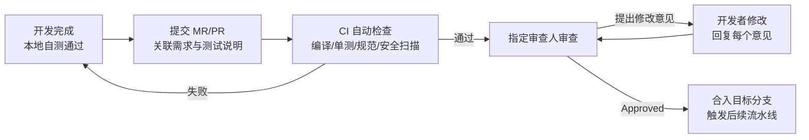

# 代码审查规范

## 1. 文档说明

| 属性 | 说明 |
|------|------|
| 文档版本 | V1.0 |
| 生效日期 | 2026-08-15 |
| 适用范围 | 公司所有研发团队的代码提交与审查流程 |
| 作者 | 架构组 |

> **核心立场**：代码审查不是「找茬」，是 **质量门禁**。所有代码必须通过审查才能合入主干分支。

---

## 2. 审查流程

### 2.1 【强制】MR/PR 审查流程

| 步骤 | 动作 | 负责人 | 时限 |
|------|------|--------|------|
| 1 | 提交 MR/PR，描述变更内容、测试情况 | 开发者 | - |
| 2 | CI 自动检查（编译、单测、规范、安全扫描） | CI 流水线 | 15 分钟内 |
| 3 | 指定审查人审查 | 审查人 | **24 小时内** 首轮回复 |
| 4 | 开发者处理意见（逐条回复 or 修改） | 开发者 | 48 小时内 |
| 5 | 审查人重新确认后 Approve | 审查人 | - |
| 6 | 合入目标分支 | 开发者/审查人 | 审批后立即 |

### 2.2 审查方式

| 方式 | 说明 | 适用场景 |
|------|------|---------|
| **异步审查（默认）** | 通过 MR/PR 评论区逐条评论，异步进行 | 绝大多数日常提交 |
| **结对审查（RTC）** | 开发者与审查人坐一起逐行过代码 | 核心/高风险模块、新人首次提交 |
| **会议评审** | 召集评审会逐模块评审 | 大型架构改动、多服务联调 |

### 2.3 【强制】禁止直接提交主分支

- 禁止直接 `push` 到 `main` / `release` 分支，必须通过 MR/PR 合入
- 分支策略详见 [Git-工作流规范.md](Git-工作流规范.md)

---

## 3. 审查清单

> 审查人按以下四类逐项检查，任意【强制】项不通过则不能 Approve。

### 3.1 功能正确性

| 检查项 | 级别 |
|--------|------|
| 业务逻辑与需求/接口文档一致 | 【强制】 |
| 边界条件（空值、超大值、并发）已处理 | 【强制】 |
| 无死代码、无用 import、未使用的变量 | 【推荐】 |
| 事务边界正确（Service 层声明、避免事务内远程调用） | 【强制】 |
| 状态机/流程流转完整（无遗漏分支） | 【强制】 |

### 3.2 性能与并发

| 检查项 | 级别 |
|--------|------|
| 无 N+1 查询（批量查询替代循环单查） | 【强制】 |
| 无全表扫描 SQL，WHERE/ORDER BY/JOIN 字段有索引 | 【强制】 |
| 大集合遍历无 O(n²) 算法 | 【推荐】 |
| 共享资源（连接池、缓存、线程池）使用正确且复用 | 【强制】 |
| 无重复创建重量级对象（每请求 new 连接等） | 【推荐】 |
| 并发场景使用线程安全容器，无裸共享可变状态 | 【强制】 |

### 3.3 安全与数据

| 检查项 | 级别 |
|--------|------|
| 无 SQL 注入（禁止字符串拼接 SQL） | 【强制】 |
| 无敏感信息硬编码（密码/Token/密钥） | 【强制】 |
| 接口有权限校验（越权防护） | 【强制】 |
| 敏感字段输出已脱敏 | 【强制】 |
| 用户输入已校验（@Valid / 白名单） | 【强制】 |
| 日志未打印敏感信息 | 【强制】 |

### 3.4 规范与可维护性

| 检查项 | 级别 |
|--------|------|
| 符合 [Java-编码规范](后端开发规范/Java-编码规范.md) / [命名规范](命名规范.md) | 【强制】 |
| 异常处理符合 [Java-异常处理规范](后端开发规范/Java-异常处理规范.md) | 【强制】 |
| 日志输出符合 [Java-日志规范](后端开发规范/Java-日志规范.md) | 【强制】 |
| 接口设计符合 [RESTful-API-设计规范](后端开发规范/RESTful-API-设计规范.md) | 【强制】 |
| 代码风格（IDEA 默认格式）统一，无格式漂移 | 【推荐】 |
| 测试覆盖核心逻辑（新增逻辑含单测） | 【推荐】 |
| 提交信息符合 Git 规范（`type(scope): 描述`） | 【强制】 |

---

## 4. 审查人职责与轮值

### 4.1 审查人资格

| 角色 | 职责 |
|------|------|
| **技术负责人** | 架构级改动、跨模块改动、新人代码 |
| **模块 Owner** | 本模块内改动 |
| **轮值审查人** | 按周轮值，兜底处理无明确 Owner 的 MR |

### 4.2 【推荐】审查人轮值表

| 周次 | 轮值人 | 负责范围 |
|------|--------|---------|
| 第 1 周 | A（后端） | 后端服务 MR |
| 第 2 周 | B（前端） | 前端服务 MR |
| 第 3 周 | C（架构） | 所有核心 MR |
| 第 4 周 | 循环 | 重新轮值 |

> 轮值表由团队负责人在每季度初更新，发布到团队群。

### 4.3 审查沟通规范

| 场景 | 规范 |
|------|------|
| 提出意见 | 用「问题描述 + 为什么 + 建议方案」三段式，禁止只丢一句「这里不行」 |
| 意见分级 | 【阻断】必须改；【建议】可选改；【疑问】需解释 |
| 回复意见 | 开发者逐条回复：改了吗 / 为什么不改（附理由） |
| 争议处理 | 无法达成一致时升级给技术负责人裁决，不僵持 |

---

## 5. 常见审查反模式（【禁止】）

| 反模式 | 说明 |
|--------|------|
| 橡皮图章 | 不看代码直接 Approve |
| 吹毛求疵 | 只揪格式不关注逻辑（格式交给 CI 检查） |
| 拖延症 | 超 48 小时不回复，阻塞合入 |
| 口头审查 | 只在群里说「看过了没问题」，不留下 Approve 记录 |
| 大 MR 陷阱 | 一次性提交 1000+ 行不拆分，导致无法有效审查 |

---

## 6. 落地检查清单

| 序号 | 检查项 | 检查方式 | 责任人 |
|------|--------|---------|--------|
| 1 | 所有合入 main/release 的代码均通过 MR/PR 审查 | Git 记录核查 | 技术负责人 |
| 2 | 审查人首轮回复时限 ≤ 24 小时 | MR 时效统计 | 团队负责人 |
| 3 | 【阻断】意见全部处理后合入 | MR 历史核查 | 审查人 |
| 4 | 轮值表已发布并执行 | 团队群/文档 | 团队负责人 |
| 5 | 无「橡皮图章」现象（抽查 Approve 记录的评论数） | 抽查 | 技术负责人 |

---

**文档结束**

*本文档由 pangpang-doc 维护*
