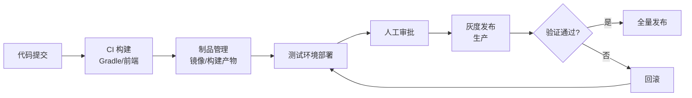

# 自动化发布流程

## 1. 文档说明

| 属性 | 说明 |
|------|------|
| 文档版本 | V1.0 |
| 生效日期 | 2026-08-15 |
| 适用范围 | 公司所有研发团队与运维 |
| 作者 | 架构组 |

> **用途**：定义从分支策略到回滚的完整自动化发布流水线，包括构建、制品、环境部署、审批、灰度与回滚，作为团队统一发布标准。

---

## 2. 发布流程总览



> 关键原则：**小步快跑、可回滚、可观测**。任何一步失败立即停止，不允许带病上线。

---

## 3. 分支策略

| 分支 | 用途 | 保护 |
|------|------|------|
| `main` | 生产稳定分支 | 禁止直接提交，需 PR 审查 |
| `develop` | 集成测试分支 | PR 合并 |
| `feature/*` | 功能开发分支 | 从 develop 切出 |
| `release/*` | 发布准备分支 | 冻结功能，只修 bug |
| `hotfix/*` | 紧急修复分支 | 从 main 切出，合回 main |

> 【强制】生产发布只允许从 `main` 或 `release/*` 分支出发；禁止直接在 `main` 上提交代码。

---

## 4. 构建与制品

### 4.1 构建阶段

```bash
# 后端：编译 + 测试 + 打镜像
./gradlew clean build test
docker build -t registry.pangpang.com/order-service:${TAG} .

# 前端：构建产物
pnpm install --frozen-lockfile
pnpm build
```

### 4.2 制品规范

| 制品 | 命名规范 | 示例 |
|------|---------|------|
| Docker 镜像 | `服务名:版本-构建号` | `order-service:1.2.0-45` |
| 前端产物 | `dist-<版本>.tar.gz` | `dist-1.2.0.tar.gz` |
| 版本号 | 语义化版本 | `1.2.0` |

> 【强制】制品必须使用唯一 tag（含版本与构建号），保证可追溯、可回滚。

---

## 5. 环境部署链路

| 环境 | 部署对象 | 数据 | 审批 |
|------|---------|------|------|
| dev | 最新 develop | 测试数据 | 无 |
| test | 待发布版本 | 测试数据 | 无 |
| staging | 与生产一致 | 脱敏数据 | 发布负责人 |
| prod | 最终发布 | 生产数据 | 审批通过 |

> 【推荐】staging 环境配置与生产一致（含监控），发布前在此完成最终验证。

---

## 6. 审批机制

1. 测试环境验证通过后，由发布人在发布平台发起「发布单」
2. 审批节点：测试负责人 → 后端负责人 → 发布负责人
3. 审批通过后自动触发灰度部署

> 【强制】生产发布必须经过至少两级审批，且发布窗口内不得再次提交代码变更。

---

## 7. 灰度发布

### 7.1 策略

| 策略 | 说明 | 适用 |
|------|------|------|
| 按比例 | 流量按百分比放量（10% → 50% → 100%） | 通用场景 |
| 按用户 | 指定内部用户/白名单先行 | 高风险变更 |
| 金丝雀 | 新版本先发单实例观察 | 全部场景建议 |

### 7.2 K8s 示例（金丝雀）

```yaml
apiVersion: apps/v1
kind: Deployment
metadata:
  name: order-service-canary
spec:
  replicas: 1
  selector:
    matchLabels:
      app: order-service
      track: canary
  template:
    metadata:
      labels:
        app: order-service
        track: canary
    spec:
      containers:
        - name: order-service
          image: registry.pangpang.com/order-service:1.2.0-45
```

> 【推荐】灰度期间重点观察错误率、响应时间、内存/CPU 三项指标，异常立即回滚。

---

## 8. 回滚机制

### 8.1 触发条件

| 指标 | 触发阈值 |
|------|---------|
| 错误率 | > 5% 持续 5 分钟 |
| 响应时间 | P95 超 500ms |
| 资源占用 | CPU/内存持续 90%+ |
| 业务指标 | 订单量/转化率异常下降 |

### 8.2 回滚操作

```bash
# Docker 部署：回退到上一版本镜像
docker run -d --name order-service-v1.1.0 \
  registry.pangpang.com/order-service:1.1.0-40

# K8s 部署：回滚到上一个 revision
kubectl rollout undo deployment/order-service -n production
```

> 【强制】每次发布前记录可回滚版本；回滚后必须复盘并更新故障记录。

---

## 9. 发布记录与复盘

发布完成后记录：

| 项 | 内容 |
|----|------|
| 版本号 | 发布版本与构建号 |
| 变更内容 | 本次发布的功能/修复 |
| 发布时间 | 起止时间 |
| 审批人 | 各级审批记录 |
| 结果 | 成功 / 失败 / 回滚 |

> 【推荐】失败或回滚的发布必须开展复盘，输出根因与改进项，纳入下一轮改进。

---

## 10. 落地检查清单

| 序号 | 检查项 | 检查方式 | 责任人 |
|------|--------|---------|--------|
| 1 | 分支策略严格执行 | 分支权限核对 | 全栈 |
| 2 | 制品 tag 唯一可追溯 | 制品仓库核对 | 运维 |
| 3 | staging 与生产配置一致 | 环境核对 | 运维 |
| 4 | 生产发布经过审批 | 发布单记录 | 发布负责人 |
| 5 | 回滚演练通过 | 定期演练 | 运维 |

---

**文档结束**

*本文档由 pangpang-doc 维护*
