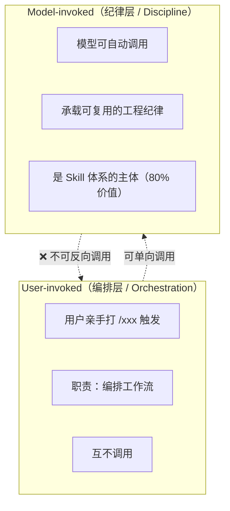
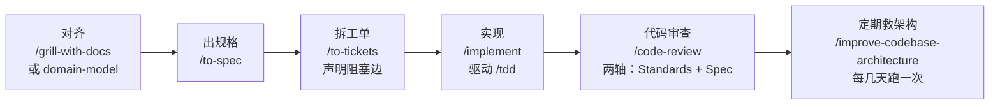

# mattpocock-skills 调研：把 Skill 当纪律，不当框架

## 1. 文档说明

| 属性 | 说明 |
|------|------|
| 文档版本 | V1.0 |
| 生效日期 | 2026-08-15 |
| 适用范围 | AI 编码工具选型、Skill 体系设计、Agent 工作流规划相关人员 |
| 作者 | 架构组 |
| 来源链接 | [微信公众号文章](https://mp.weixin.qq.com/s/01pctmUOs9-nJU8dO_mp_A) |

---

## 2. 背景与动机

### 2.1 业务背景

| 维度 | 现状描述 |
|------|---------|
| 所属领域 | AI 编码工具 / Agent Skill 体系 |
| 仓库规模 | `mattpocock/skills` 创建于 2026-02-03，截至 2026 年 7 月中旬 star 数达 170,525，5 个月内冲到 17 万+ |
| 作者背景 | Matt Pocock，Total TypeScript 作者，TypeScript 教育领域知名人物，运营 aihero.dev，newsletter 约 6 万开发者订阅 |
| 核心问题 | AI 编码场景中 Agent 失控：改 40+ 文件后报空指针、修一个 bug 牵出三个新 bug、变量名混乱、注释与代码脱节 |

### 2.2 现状分析与痛点

| 序号 | 痛点描述 | 严重程度 | 量化数据 | 直接影响 |
|------|---------|---------|---------|---------|
| 1 | Agent 不按预期执行（对不齐） | 高 | 你说清楚了，AI 理解的是另一回事 | 返工、交付延迟 |
| 2 | Agent 代码过于冗长（太啰嗦） | 高 | 20 个词说 1 个词的事，变量名长到读不完 | 代码可读性差、维护困难 |
| 3 | 代码跑不起来（跑不起来） | 高 | 看着对，跑就崩 | 功能不可用、信任崩塌 |
| 4 | 架构劣化（架构烂成泥） | 中 | Agent 加速编码也加速软件熵，代码变成「泥球」 | 技术债累积、重构成本飙升 |

### 2.3 调研目标

- **理解 mattpocock/skills 的核心理念**：为何 17 万 star 的仓库作者却撤下自己最火的 skill
- **提炼 Skill 体系设计原则**：小、可改、可组合、跨模型、基于工程基础
- **对比重量级框架**（GSD / BMAD / Spec-Kit）与轻量 Skill 集合的根本分野
- **输出落地建议**：中文项目、国内团队如何选用和落地

---

## 3. 核心概念

### 3.1 基础术语表

| 术语 | 英文全称 | 一句话定义 | 与本项目的关联 |
|------|---------|-----------|--------------|
| Skill | Skill | Agent 可执行的一段指令/纪律，小而可组合 | 本调研的核心研究对象 |
| User-invoked | User-invoked Skill | 只能由用户亲手打 `/xxx` 触发的编排层 Skill | 决定了流程控制权在用户手中 |
| Model-invoked | Model-invoked Skill | 模型可自动调用的纪律层 Skill | 承载可复用的工程纪律 |
| 共享语言 | Ubiquitous Language | 来自 DDD，将冗长业务描述压缩为术语表写入 `CONTEXT.md` | 解决 Agent 命名混乱、Token 浪费 |
| 盘问 | Grilling Session | 对齐需求的迭代提问过程 | 解决「Agent 没做我想要的」问题 |
| 反馈回路 | Feedback Loop | 静态类型、浏览器访问、自动化测试构成的验证环 | 解决「代码跑不起来」问题 |
| 软件熵 | Software Entropy | 代码随时间推移复杂度不断增加的自然趋势 | Agent 加速编码也加速熵增 |

### 3.2 核心原理：两层分离架构

**铁律原文**：「A user-invoked skill may invoke model-invoked skills, but never another user-invoked one.」

- 编排层能调纪律层，但编排层之间不互调
- 这条单向边让整条链永远从用户手里发起，不会自己长出新入口让 Agent 乱窜

**核心立场**（全文围绕）：

> **把 Skill 当纪律，不当框架。**
>
> 纪律（Discipline）= 你在写每一篇文档/每一段代码时都必须自动遵守的约束。
> 框架（Framework）= 你需要刻意去套用的模板或流程。
>
> Skill 不是供起来的框架，是随时该被替换、被 hack、被组合的一次性纪律。

---

## 4. 方案对比分析

### 4.1 备选方案列表

| 方案 ID | 方案名称 | 一句话描述 | 方案类型 |
|---------|---------|-----------|---------|
| **方案 A** | mattpocock/skills | 小、可改、可组合的 Skill 集合，控制权在用户 | 轻量纪律工具箱 |
| **方案 B** | GSD / BMAD / Spec-Kit | 接管整套流程的重量级框架，省心但失控 | 重量级流程框架 |

### 4.2 多维度对比表

| 对比维度 | 方案 A（mattpocock/skills） | 方案 B（GSD/BMAD/Spec-Kit） | 评分依据说明 |
|---------|---------------------------|---------------------------|-------------|
| **流程控制权** | 用户保留全部控制权 | 框架接管流程，用户被裹挟 | A 的编排权留在用户手里；B 的状态机互相跳转 |
| **可修改性** | skills.sh 装的是可编辑副本，可 hack | 框架内部逻辑不可改 | A 设计为「make them your own」；B 出 bug 难修 |
| **组合灵活性** | Skill 随时替换/降级/组合 | 固定流程，需按框架顺序走 | Matt 撤下 grill-me 正是「该降级就降级」的范例 |
| **学习曲线** | 先装 3 件套即可起步 | 需学整套框架才能用 | A 推荐先装 grill-with-docs + tdd + code-review |
| **跨模型兼容** | 支持任意遵循 Agent-Skills 标准的 agent | 通常绑定特定平台 | A 的 skills.sh 安装器已支持 Codex 等 |
| **工程理论背书** | 引用 Pragmatic Programmer、DDD、XP 等经典 | 各自有独立方法论 | A 把几十年工程纪律翻译成 agent 指令 |
| **失控风险** | 低（单向调用 + 用户发起） | 高（编排层互相打架） | A 的铁律防止 Agent 乱窜；B 状态机跳转难 debug |

### 4.3 各方案优劣势分析

#### 方案 A：mattpocock/skills

| 维度 | 描述 |
|------|------|
| ✅ **优势** | • 小、可改、可组合、跨模型，基于工程基础 • 两层分离架构（User-invoked / Model-invoked），单向调用防失控 • 引用经典工程书籍背书（Pragmatic Programmer、DDD、XP、软件设计哲学） • 17 万 star 社区活跃，但核心价值在纪律而非热度 |
| ❌ **劣势** | • 不接管流程，需要用户自己编排工作流 • Skill 需要团队自行改造适配（skills.sh 路线） • 中文项目/国内团队需要额外适配（issue tracker、术语表等） |
| ⚠️ **风险点** | 社区跟风水分大；需确认是纪律工具箱而非又一个吃灰插件 |

#### 方案 B：GSD / BMAD / Spec-Kit

| 维度 | 描述 |
|------|------|
| ✅ **优势** | • 接管整套流程，上手省心 • 固定流程路径，减少决策负担 |
| ❌ **劣势** | • 接管流程 = 拿走控制权 • 流程本身出 bug 难修（你是被流程裹挟的人） • 上层编排互相打架，debug 时要先搞清自己在哪个节点 |
| ⚠️ **风险点** | 团队流程还没稳定就用重框架，等于在不稳定的地基上盖楼 |

---

## 5. 实施建议

### 5.1 推荐选型结论

**【推荐结论】推荐采用「方案 A：mattpocock/skills」作为 AI 编码 Skill 体系的基础**

- 核心理由：
  1. **控制权在用户**：两层分离 + 单向调用铁律，防止 Agent 乱窜
  2. **小而可组合**：先装 3 件套即可起步，不要求全装
  3. **工程纪律背书**：把几十年工程经典翻译成 Agent 可执行的指令
- 不推荐方案 B 的原因：接管流程 = 失控难修；团队流程还没稳定时先用不接管的，等纪律内化再考虑更重的框架

### 5.2 AI 编码 4 大失败模式与对症修复

| 失败模式 | 表现 | 修复 Skill | 工程经典引用 |
|---------|------|-----------|-------------|
| ① 对不齐 | Agent 没做我想要的 | `grill-with-docs`（盘问 + 共享语言 + ADR） | Pragmatic Programmer: "No-one knows exactly what they want." |
| ② 太啰嗦 | 20 词说 1 词的事 | 共享语言 → `CONTEXT.md` | Eric Evans《领域驱动设计》: Ubiquitous Language |
| ③ 跑不起来 | 看着对，跑就崩 | `tdd` + `diagnosing-bugs`（reproduce→minimise→hypothesise→instrument→fix→regression-test） | Pragmatic Programmer: "The rate of feedback is your speed limit." |
| ④ 架构烂 | 软件熵加速 | `to-spec` + `improve-codebase-architecture` | Kent Beck《XP》: "Invest in the design every day." + Ousterhout: "The best modules are deep." |

### 5.3 推荐落地工作流

**具体示例（导出报表需求）**：

1. `/grill-with-docs`：把「报表」「导出」「分页」几个词在 `CONTEXT.md` 里定死
2. `/to-spec`：落成可验证的规格
3. `/to-tickets`：拆成「数据源查询」「格式渲染」「分页接口」三个工单，标注后者阻塞前者
4. `/implement`：在每个工单的接缝处驱动 `/tdd`，红测试先写，绿了再提交，`/code-review` 两轴过一遍
5. 两周后跑一次 `/improve-codebase-architecture`，只给建议不擅自改

### 5.4 两种安装哲学

| 维度 | skills.sh（可编辑副本） | Claude Code Plugin（只读订阅） |
|------|------------------------|------------------------------|
| 安装命令 | `npx skills@latest add mattpocock/skills` | `/plugin install mattpocock-skills@mattpocock` |
| 可修改性 | ✅ 可 hack、改成自己的 | ❌ 只读、不可编辑 |
| 更新方式 | 手动维护 | 永远最新、跟着上游走 |
| 适用人群 | 想改造成团队规范 | 只想蹭一套靠谱默认 |
| 适用阶段 | 团队刚上手时先用 | 全组跑顺后切换 |

> **判断**：没有两全其美的策略。团队刚上手先用 skills.sh 更稳（迟早要改适配 issue 流程和标签）；全组跑顺后切 plugin 跟着上游走，省维护。

### 5.5 中文项目落地建议

| 建议项 | 说明 |
|--------|------|
| 先装哪几个 | 先装 `grill-with-docs` + `tdd` + `code-review` 三件套，跑顺再加 `to-spec`、`to-tickets`、`implement` |
| 为什么先这三件套 | grill-with-docs 治「对不齐」、tdd 治「跑不起来」、code-review 治「写完没人卡」，覆盖最高频翻车点 |
| 共享语言中文化 | 中文业务描述更长更绕，压成术语表收益比英文项目更大。如「用户在下单后 15 分钟内未支付则订单进入待关闭状态并释放库存」→ 压缩为「超时释单」四个字 |
| 术语表维护 | `CONTEXT.md` 不是写完就完，业务词变了要跟着改，否则 Agent 又回到各说各话 |
| Issue Tracker | 国内多用 GitHub 或本地文件，Linear 用得少，setup 时按实际选 |
| 安装方式 | 想改造成团队规范 → skills.sh；只想蹭默认 → plugin。不建议混用 |

---

## 6. 风险评估与应对

| 风险 ID | 风险描述 | 发生概率 | 影响程度 | 触发条件 | 应对预案 / 缓解措施 |
|---------|---------|---------|---------|---------|-------------------|
| R1 | 17 万 star 跟风水分大，3 个月后遗忘 | 中 | 中 | 社区热度下降、停止维护 | 关注 Matt 的 aihero.dev 博客更新；skills.sh 装的可编辑副本不受上游停更影响 |
| R2 | 把 Skill 当框架供着，变成吃灰插件 | 高 | 高 | 团队装了但不改、不组合、不降级 | 坚守「把 Skill 当纪律不当框架」立场；定期 review 使用效果 |
| R3 | 中文项目共享语言效果不及预期 | 低 | 中 | Agent 仍然命名混乱 | 术语表需全组统一写入 `CONTEXT.md`，专人值守维护；术语变更同步更新 |
| R4 | skills.sh 和 plugin 混用导致版本冲突 | 中 | 低 | 同一 skill 两份来源、版本对不上 | 选一个跟到底，禁止混用 |
| R5 | 重编排 Skill（to-spec / to-tickets / implement）上手门槛高 | 中 | 中 | 团队一上来全装导致被晃晕 | 先跑顺三件套节奏再加重的编排 Skill |

---

## 7. 落地检查清单

| 检查项 | 级别 | 检查方法 | 评审结果 |
|--------|------|---------|---------|
| §2 背景章节：痛点已量化（4 大失败模式均有表现 + 影响） | 【强制】 | 核对痛点表 | □ 通过 / □ 不通过 |
| §3 核心概念：两层分离架构铁律清晰（单向调用） | 【强制】 | 核对 Mermaid 图 + 铁律原文 | □ 通过 / □ 不通过 |
| §4 对比分析：mattpocock/skills vs 重量级框架，≥6 维度 | 【强制】 | 核对对比表 | □ 通过 / □ 不通过 |
| §5.2 4 大失败模式与修复 Skill 一一对应 | 【强制】 | 核对失败模式表 | □ 通过 / □ 不通过 |
| §5.3 落地工作流链路完整（对齐→规格→工单→实现→审查→救架构） | 【强制】 | 核对流程图 + 示例 | □ 通过 / □ 不通过 |
| §5.4 两种安装哲学差异说明清晰 | 【推荐】 | 核对安装对比表 | □ 通过 / □ 不通过 |
| §5.5 中文项目落地建议具体可操作 | 【推荐】 | 核对落地建议表 | □ 通过 / □ 不通过 |
| §6 风险评估：≥4 项，每项有触发条件和应对预案 | 【强制】 | 核对风险评估表 | □ 通过 / □ 不通过 |
| 核心立场「把 Skill 当纪律，不当框架」贯穿全文 | 【强制】 | 全文通读验证 | □ 通过 / □ 不通过 |

---

*本文档由 pangpang-doc 维护，来源：[微信公众号文章](https://mp.weixin.qq.com/s/01pctmUOs9-nJU8dO_mp_A)*
