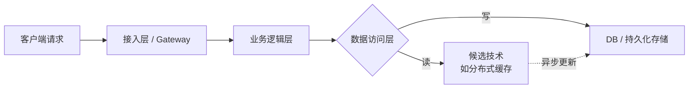

# 技术选型模板

## 1. 文档说明

| 属性 | 说明 |
|------|------|
| 文档版本 | V1.0 |
| 生效日期 | 2026-08-15 |
| 适用范围 | 所有需要引入新技术、新框架、新中间件的技术调研与选型项目 |
| 作者 | 架构组 |

> **使用提示**：本文档为 **新技术调研 / 技术选型** 专用模板，严格对齐文档项目技能体系的调研文档骨架。使用者请按章节顺序填写，所有 `<!-- -->` 注释内容需替换为真实调研结论，示例表格中的占位文本在提交前请清理。

---

## 2. 背景与动机

### 2.1 业务背景

<!-- 使用者请替换：描述本次选型所服务的业务场景，包括业务体量、用户规模、关键指标等。可使用表格或条目列举。 -->

| 维度 | 现状描述 |
|------|---------|
| 所属业务线 | `{业务线名称，如：电商交易中台}` |
| 服务用户规模 | `{日活 / 月活，如：DAU 50w / MAU 1200w}` |
| 核心业务指标 | `{如：订单 TPS 峰值 2000、接口 P99 < 200ms}` |
| 相关项目/版本 | `{如：V2.0 架构升级项目，预计 2026-Q4 上线}` |

### 2.2 现状分析与痛点

> 明确 **为什么要做这次选型**，不能是"想试试新技术"。必须量化痛点，给出数据支撑。

<!-- 使用者请替换：列举 3-6 个真实痛点，每个痛点补充定性 + 定量描述 -->

| 序号 | 痛点描述 | 严重程度 | 量化数据 | 直接影响 |
|------|---------|---------|---------|---------|
| 1 | `{如：现有单体应用构建速度慢}` | 高 | `{如：全量构建 15 分钟，PR 校验阻塞团队}` | 交付周期延长、迭代效率 |
| 2 | `{如：缓存层穿透问题频发}` | 高 | `{如：DB 峰值 QPS 超阈值 3 倍，多次触发告警}` | 稳定性、成本（DB 扩容） |
| 3 | `{如：日志排查链路不完整}` | 中 | `{如：跨服务 TraceId 缺失率约 23%}` | 排错效率、用户体验 |

### 2.3 调研目标

> 目标必须 **SMART**：具体（Specific）、可衡量（Measurable）、可实现（Attainable）、相关（Relevant）、有时限（Time-bound）。

<!-- 使用者请替换：填写本项目的选型目标 -->

- **功能目标**：解决 `{上述痛点 1 + 痛点 2}` 的核心问题，满足 `{核心业务}` 的功能需求
- **性能目标**：`{如：接口 P99 从 300ms 降低到 100ms 以内，吞吐量提升 2 倍}`
- **非功能目标**：
  - 可用性：SLA ≥ 99.95%
  - 可扩展性：支持水平扩展至 `{如：10 倍业务量}` 无需架构级改造
  - 运维成本：引入后运维工作量增加不超过 `{如：20%}`，有成熟社区/商业支持
- **时间目标**：POC 验证 `{如：2 周}` 完成，正式上线 `{如：2026-10-31}` 前

---

## 3. 核心概念

> 本章节让所有读者（包括非选型负责人）在 3 分钟内快速了解候选技术的 **基础术语** 和 **核心原理**，避免后续讨论出现概念歧义。

### 3.1 基础术语表

<!-- 使用者请替换：列出该领域的 5-10 个关键术语，给出一句话定义 -->

| 术语 / 缩写 | 英文全称 | 一句话定义 | 与本项目的关联 |
|------------|---------|-----------|--------------|
| `{术语1}` | `{英文全称}` | `{定义，如：Inverted Index 倒排索引是一种...}` | `{本项目用它解决...}` |
| `{术语2}` | `{英文全称}` | `{定义}` | `{关联}` |
| `{术语3}` | `{英文全称}` | `{定义}` | `{关联}` |
| `{术语4}` | `{英文全称}` | `{定义}` | `{关联}` |
| `{术语5}` | `{英文全称}` | `{定义}` | `{关联}` |

### 3.2 原理机制

> 用 Mermaid 图或文字说明候选技术的 **工作原理 / 核心流程**。下图为通用骨架，使用者请替换为实际技术的原理。

**核心原理文字说明**（图无法渲染时参考）：

<!-- 使用者请替换：3-5 条核心机制描述 -->

1. **机制 1**：`{如：基于一致性 Hash 分片，支持节点动态扩缩容}`
2. **机制 2**：`{如：WAL 预写日志保证数据持久化，RPO < 1s}`
3. **机制 3**：`{如：读多写少场景下采用旁路缓存模式 Cache-Aside Pattern}`
4. **机制 4**：`{如：通过 XX 协议保证多副本强一致 / 最终一致}`

---

## 4. 方案对比分析

> 选型对比的 **核心章节**。至少对比 3 个方案（禁止"现有方案 vs 目标方案"二元对比，至少要有一个备选方案），每个维度给出 **量化数据** 而非主观评价。

### 4.1 备选方案列表

<!-- 使用者请替换：列出 ≥3 个候选方案，"方案 A 现状/保守"、"方案 B 主流推荐"、"方案 C 激进/前沿" 搭配更有决策价值 -->

| 方案 ID | 方案名称 | 一句话描述 | 方案类型 |
|---------|---------|-----------|---------|
| **方案 A** | `{如：继续使用 Redis Cluster 自建缓存}` | `{维持现状，不引入新技术}` | 保守 / 现状 |
| **方案 B** | `{如：引入 Apache Pulsar 作为消息中间件}` | `{业界主流，社区活跃}` | 主流推荐 |
| **方案 C** | `{如：使用 云厂商托管 Serverless 缓存服务}` | `{成本高但免运维}` | 前沿 / 云原生 |

### 4.2 多维度对比表

【强制】对比维度 ≥ 6 个，包含但不限于下表。打分建议采用 5 分制：1 = 极差，3 = 合格，5 = 优秀。

<!-- 使用者请替换：填充真实数据，评分需有依据，禁止拍脑袋 -->

| 对比维度 | 权重 | 方案 A（保守）评分 | 方案 B（主流）评分 | 方案 C（前沿）评分 | 评分依据说明 |
|---------|------|-------------------|-------------------|-------------------|-------------|
| **功能完备度** | 高 | 3 / 5 | 5 / 5 | 4 / 5 | `{如：A 缺少延迟消息，B 原生支持，C 支持但有限额}` |
| **性能与吞吐** | 高 | 3 / 5 | 4 / 5 | 5 / 5 | `{如：压测数据：A 3w TPS，B 10w TPS，C 15w TPS 弹性扩容}` |
| **稳定性 / 可用性** | 高 | 4 / 5 | 4 / 5 | 5 / 5 | `{如：A 团队自运维 SLA 99.9%，B/C 厂商承诺 99.95%}` |
| **学习与迁移成本** | 中 | 5 / 5 | 3 / 5 | 2 / 5 | `{如：A 无迁移成本；B 团队需学 2 周；C 强绑定云厂商}` |
| **社区与生态** | 中 | 4 / 5 | 5 / 5 | 3 / 5 | `{如：B GitHub Stars 12.5w，Stack Overflow 回答 90%+}` |
| **长期可维护性** | 中 | 2 / 5 | 4 / 5 | 4 / 5 | `{如：A 需自建团队 2 人运维；B/C 有商业支持}` |
| **总拥有成本 TCO（3 年）** | 高 | 4 / 5 | 3 / 5 | 2 / 5 | `{如：A = 40 万（人+机器），B = 65 万，C = 90 万}` |
| **厂商绑定风险** | 中 | 5 / 5 | 5 / 5 | 1 / 5 | `{如：C 强绑定云厂商，切换成本极高}` |
| **加权总分** | - | **3.60** | **4.15** | **3.30** | `(各维度评分 × 权重) / 权重合计` |

### 4.3 各方案优劣势分析

#### 方案 A：`{方案名}`

| 维度 | 描述 |
|------|------|
| ✅ **优势** | • `{如：团队熟悉，迁移成本为零}`  • `{如：无厂商绑定，灵活度高}`  • `{如：TCO 最低}` |
| ❌ **劣势** | • `{如：功能缺失，需自研补齐 2-3 个能力}`  • `{如：自运维人力成本高，SLA 无保障}`  • `{如：性能上限明显，未来 6 个月会触顶}` |
| ⚠️ **风险点** | `{如：自研组件缺乏文档，人员流动后维护困难}` |

#### 方案 B：`{方案名}`

| 维度 | 描述 |
|------|------|
| ✅ **优势** | • `{如：功能最完整，覆盖所有业务场景}`  • `{如：社区生态成熟，问题可快速检索到答案}`  • `{如：符合业界主流趋势，招聘难度低}` |
| ❌ **劣势** | • `{如：引入需 2 周学习 + 1 周 POC，工期略紧}`  • `{如：TCO 中等偏高}` |
| ⚠️ **风险点** | `{如：新版本 API 变更频繁，需锁定 LTS 版本}` |

#### 方案 C：`{方案名}`

| 维度 | 描述 |
|------|------|
| ✅ **优势** | • `{如：性能最强，弹性扩容无需操心}`  • `{如：免运维，团队聚焦业务开发}` |
| ❌ **劣势** | • `{如：TCO 最高，预算压力大}`  • `{如：强厂商绑定，迁移成本极高}`  • `{如：专有能力无法在本地环境调试，开发体验差}` |
| ⚠️ **风险点** | `{如：厂商调价、服务中断、限额策略变化均不可控}` |

---

## 5. 实施建议

### 5.1 推荐选型结论

> 明确、直接给出结论，**禁止模棱两可**。结论必须和 §4.2 的加权总分、§4.3 的优劣势分析逻辑自洽。

<!-- 使用者请替换：根据实际对比结论填写 -->

**【推荐结论】推荐采用「方案 B：XXX 作为技术选型方案」**

- 核心理由：
  1. **功能 + 性能双达标**：加权总分最高（4.15 / 5），功能完备度、生态成熟度、性能均满足业务需求；
  2. **风险可控**：无厂商绑定，学习曲线在团队接受范围内（2 周学习 + 1 周 POC）；
  3. **长期价值**：业界主流趋势，未来 3-5 年内不会被淘汰，人才储备和社区支持有保障。
- 不推荐方案 A 的原因：功能缺失需自研补齐 2-3 个能力，自运维 SLA 不达标，长期维护成本高于引入成本。
- 不推荐方案 C 的原因：强厂商绑定带来不可控风险，TCO 超预算 50%+，不符合当前阶段成本约束。

### 5.2 分阶段实施路径

【强制】落地路径必须拆解为 **可度量的里程碑**，明确每阶段的交付物、验收标准、责任人和预计时间。

<!-- 使用者请替换：按项目实际情况调整阶段和时间 -->

| 阶段 | 时间范围 | 核心任务 | 关键交付物 | 验收标准 | 责任人 |
|------|---------|---------|-----------|---------|--------|
| **阶段 1：POC 验证** | W1-W2 | 搭建最小化 Demo，核心链路压测，兼容性验证 | POC 报告、压测数据、Demo 代码仓库 | 压测指标达标（≥目标值 80%），核心功能跑通 | 张三 |
| **阶段 2：技术预研 + 培训** | W3-W4 | 团队学习、输出 Best Practice 文档、公共组件封装 | 培训 PPT、封装好的 Starter/SDK、编码规范 | 团队 80% 成员通过技术考试，SDK 单元测试覆盖率 ≥ 80% | 李四 |
| **阶段 3：灰度上线** | W5-W8 | 非核心业务试点接入（如内部管理后台），线上观察 2 周 | 灰度接入方案、监控大盘、SOP 文档 | 灰度期间 P0/P1 故障 = 0，SLA ≥ 99.9% | 王五 |
| **阶段 4：全面替换 + 旧方案下线** | W9-W12 | 核心业务全量接入，旧系统双写→切读→下线 | 迁移方案、回滚预案、全量上线报告 | 全量上线观察 1 周无 P0/P1，旧系统流量 = 0 | 赵六 |

### 5.3 团队技能准备

| 技能点 | 当前状态（1-5） | 目标状态 | 提升方式 | 预计完成时间 |
|--------|----------------|---------|---------|-------------|
| `{如：分布式缓存原理}` | 2 / 5 | 4 / 5 | 内部分享会 2 次 + 课后作业 | W2 末 |
| `{如：XX 中间件运维}` | 1 / 5 | 3 / 5 | 厂商培训 + 沙盒实操 | W4 末 |
| `{如：故障排查工具链}` | 3 / 5 | 4 / 5 | 实战演练 + SOP 输出 | W4 末 |

---

## 6. 风险评估与应对

<!-- 使用者请替换：风险项 ≥ 4 项，每项必须有"触发条件 + 应对预案" -->

| 风险 ID | 风险描述 | 发生概率 | 影响程度 | 触发条件 | 应对预案 / 缓解措施 | 责任人 |
|---------|---------|---------|---------|---------|-------------------|--------|
| R1 | `{如：团队学习曲线超预期，POC 工期延迟}` | 中 | 中 | W2 末 POC 关键指标未达标 | 申请厂商技术支持 8 人日；提前拉 1 名资深同事投入 POC | 张三 |
| R2 | `{如：新版本发布引入 Breaking Change}` | 低 | 高 | 升级后接口/配置报错 | 锁定 **LTS 版本**（如 `v8.x LTS`），禁止盲目追最新；CI 中加兼容性测试 | 李四 |
| R3 | `{如：生产高并发场景下出现未知性能瓶颈}` | 中 | 高 | 灰度期间 QPS 达 50% 时出现超时/报错 | 做好流量染色 + 灰度回滚预案；压测补足到 2 倍预期峰值；关键路径保留降级开关 | 王五 |
| R4 | `{如：社区活跃度下降，不再维护}` | 低 | 中 | 6 个月无 Release，Issue 响应 > 14 天 | 选型时确认基金会/商业公司背书；提前准备替换方案 B'（方案 C 降级备选） | 架构组 |
| R5 | `{如：引入组件与现有技术栈冲突（如 Jar 包依赖版本冲突）}` | 中 | 低 | 本地启动 / CI 构建失败 | POC 阶段强制完成依赖树冲突排查；使用 Gradle/Maven 强制版本对齐；准备 Shaded 包备选 | 李四 |

---

## 7. 落地检查清单

> 以下 Checklist 用于 **选型评审会** 逐项过堂，所有 【强制】项必须全部通过才能进入实施阶段。

| 检查项 | 级别 | 检查方法 | 评审结果 |
|--------|------|---------|---------|
| §2 背景章节：痛点已量化、目标符合 SMART 原则 | 【强制】 | 人工核对数据来源 | □ 通过 / □ 不通过 |
| §3 核心概念：术语表完整、原理无歧义 | 【推荐】 | 团队评审确认 | □ 通过 / □ 不通过 |
| §4 对比分析：候选方案 ≥ 3 个，对比维度 ≥ 6 个，打分有量化依据 | 【强制】 | 核对对比表 + 评分依据说明 | □ 通过 / □ 不通过 |
| §4.2 加权总分与 §5.1 选型结论逻辑自洽 | 【强制】 | 逻辑推导验证 | □ 通过 / □ 不通过 |
| §5.2 实施路径：拆解为 ≥ 4 阶段，每阶段有明确交付物、验收标准和责任人 | 【强制】 | 核对实施路径表 | □ 通过 / □ 不通过 |
| §5.3 团队技能差距已识别并制定提升计划 | 【推荐】 | 核对技能准备表 | □ 通过 / □ 不通过 |
| §6 风险评估：风险项 ≥ 4 项，每项有触发条件和应对预案 | 【强制】 | 核对风险评估表 | □ 通过 / □ 不通过 |
| TCO 测算：3 年总拥有成本（许可/云资源/人力/培训/风险成本）已评审 | 【强制】 | 财务或技术负责人确认 | □ 通过 / □ 不通过 |
| 回滚预案：若上线后出现 P0 故障，能在多少时间内恢复到旧方案（RTO ≤ 4h 为合格） | 【强制】 | 模拟演练或方案评审 | □ 通过 / □ 不通过 |
| 相关干系人（业务/产品/运维/安全）均已评审并签字 | 【强制】 | 评审会议纪要 | □ 通过 / □ 不通过 |

---

*本文档由 pangpang-doc 维护*
