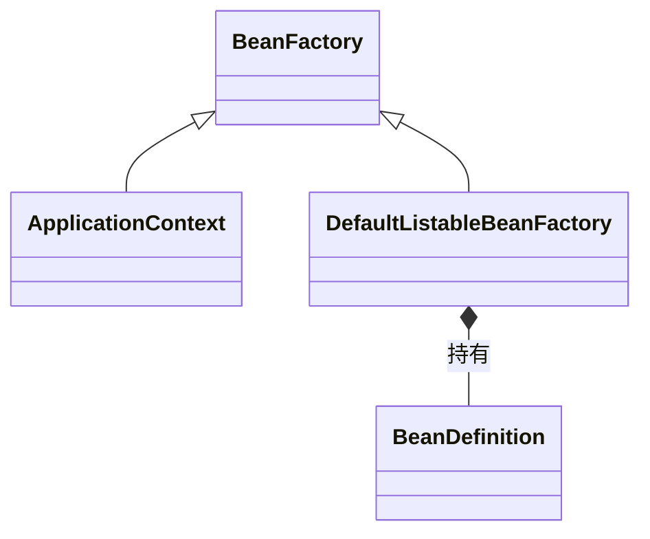
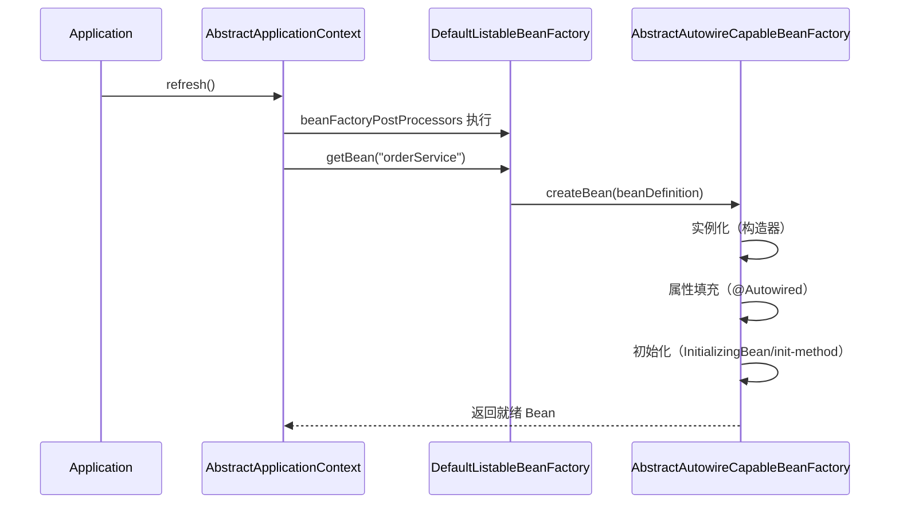
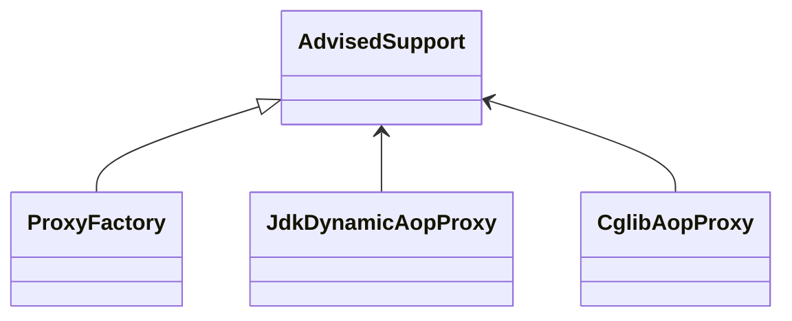

# Spring 源码分析

## 1. 文档说明

| 属性 | 说明 |
|------|------|
| 文档版本 | V1.0 |
| 生效日期 | 2026-08-15 |
| 适用范围 | 公司所有后端研发团队 |
| 作者 | 架构组 |

> **用途**：提供 Spring 源码分析方法论（3 步读源码）与分析模板（类图/时序图/设计模式/启发），并以 Spring IoC 与 AOP 为例演示如何落地。通用模板见 [其他框架源码.md](./其他框架源码.md)。

---

## 2. 源码分析方法论（3 步）

1. **先画轮廓**：从官方文档/入口类（`main`/`FactoryBean`）入手，理清核心类关系，不陷入细节
2. **抓主链路**：选择一个典型调用场景，沿主流程标注关键类与调用点
3. **总结沉淀**：提炼设计模式、扩展点与启发，输出类图/时序图

> 【推荐】每次只读一个主流程（如「Bean 创建」），用「入口 → 关键类 → 关键方法」三层笔记法记录。

---

## 3. 分析模板

| 章节 | 要求 |
|------|------|
| 框架概览 | 核心职责与模块划分 |
| 核心类图 | 类与接口的关系 |
| 核心时序图 | 一次主流程的调用顺序 |
| 关键流程 | 分步骤说明 |
| 设计模式 | 用到的模式与意图 |
| 启发 | 对日常开发的可借鉴点 |

---

## 4. Spring IoC 分析示例

### 4.1 核心类图

### 4.2 Bean 创建时序图

### 4.3 关键流程

1. `refresh()`：刷新容器，注册 BeanDefinition、处理 BeanFactoryPostProcessor
2. `getBean()`：先查单例缓存（三级缓存），未命中则创建
3. `createBean()`：实例化 → 属性填充 → Aware 回调 → 初始化
4. 循环依赖通过三级缓存解决（提前暴露代理）

### 4.4 设计模式

| 模式 | 体现 |
|------|------|
| 工厂模式 | `BeanFactory` 创建对象 |
| 模板方法 | `AbstractApplicationContext.refresh()` 骨架 |
| 观察者模式 | 事件发布 `ApplicationEvent` |
| 策略模式 | 处理器/解析器接口可插拔 |

### 4.5 启发

- 使用「三级缓存 + 提前暴露」解循环依赖的思路可借鉴到业务设计
- 善用 `BeanPostProcessor` 扩展点做统一增强（如日志、脱敏）
- `refresh()` 模板方法模式适合构建「固定流程 + 可变步骤」的框架

---

## 5. Spring AOP 分析示例

### 5.1 核心类图

### 5.2 关键流程

1. 解析 `@Aspect`，生成 `Advisor`（切点 + 通知）
2. `ProxyFactory` 根据目标类是否接口选择 JDK 动态代理或 CGLIB
3. 调用时按 `Advisor` 链依次执行通知（环绕/前置/后置）

### 5.3 设计模式与启发

- **代理模式**：增强不侵入业务代码
- **责任链模式**：拦截器链依次执行
- 启发：切面只做横切关注点（日志/事务/限流），不要承载业务逻辑

---

## 6. 延伸阅读建议

- Spring Boot 4.x 自动装配原理（`spring.factories`/`AutoConfiguration`）
- Spring Cloud 2024.x 服务发现与负载均衡（Nacos 集成）
- Spring Data JPA 3.x 仓储动态代理原理

> 【推荐】每读完一个主题，用本文模板输出一份「源码阅读笔记」沉淀到本目录。

---

## 7. 落地检查清单

| 序号 | 检查项 | 检查方式 | 责任人 |
|------|--------|---------|--------|
| 1 | 已按 3 步法完成一次主流程阅读 | 输出类图/时序图 | 后端开发 |
| 2 | 分析模板章节完整 | 笔记检查 | 后端开发 |
| 3 | 设计模式提炼到位 | 评审确认 | 架构师 |
| 4 | 启发可落地到业务 | 代码中体现 | 后端开发 |
| 5 | 笔记沉淀到本目录 | 文件核对 | 后端开发 |

---

**文档结束**

*本文档由 pangpang-doc 维护*
