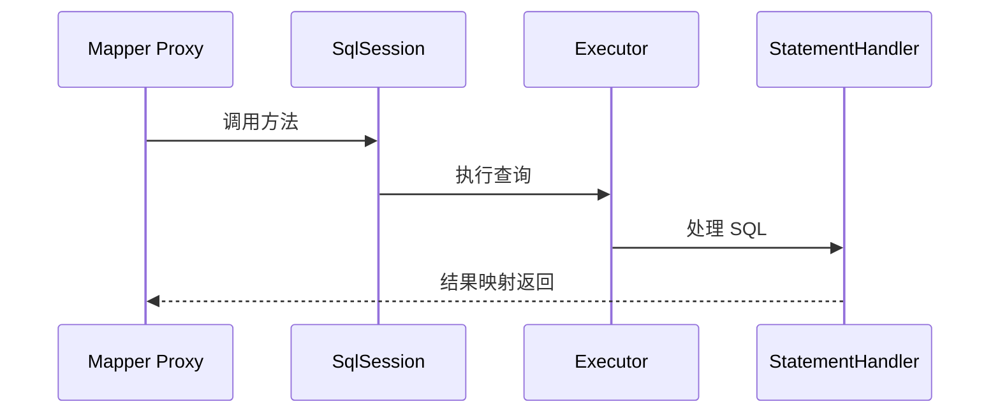
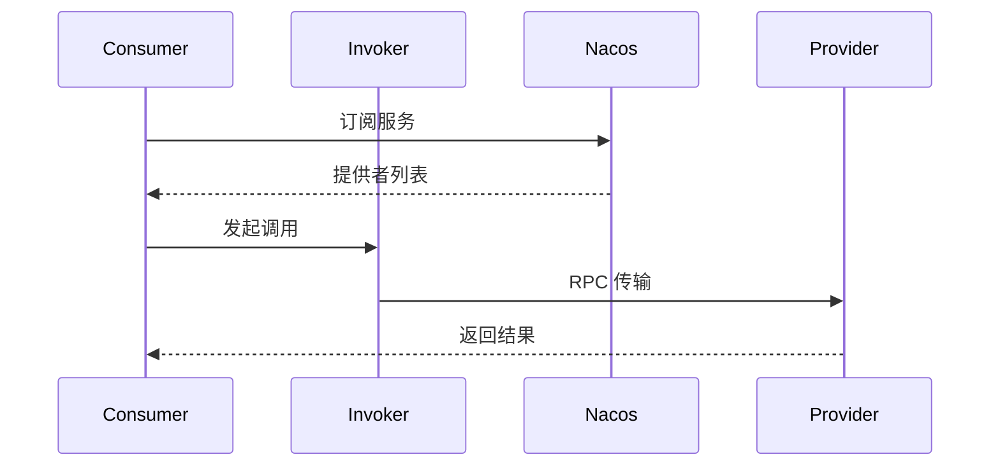

# 其他框架源码

## 1. 文档说明

| 属性 | 说明 |
|------|------|
| 文档版本 | V1.0 |
| 生效日期 | 2026-08-15 |
| 适用范围 | 公司所有研发团队 |
| 作者 | 架构组 |

> **用途**：提供通用框架源码阅读模板，适用于 MyBatis、Dubbo、Vue、Spring 之外的任何框架，并给出适配示例。Spring 专项见 [Spring-源码分析.md](./Spring-源码分析.md)。

---

## 2. 通用分析模板

| 章节 | 要求 |
|------|------|
| 框架概览 | 定位、解决的问题、模块划分 |
| 核心类图 | 核心类与接口关系 |
| 核心时序图 | 一次主流程的调用顺序 |
| 关键流程 | 分步骤说明（含关键方法） |
| 设计模式 | 用到的模式与意图 |
| 扩展点 | 开发者可定制的点 |
| 启发 | 对日常开发的可借鉴点 |

---

## 3. MyBatis 适配示例

### 3.1 核心时序图



### 3.2 关键流程

1. Mapper 接口通过 JDK 动态代理生成代理对象
2. 方法调用转为 `SqlSession` 操作（MappedStatement）
3. `Executor` 缓存与 SQL 执行，`ResultSetHandler` 结果映射

### 3.3 设计模式与启发

- **动态代理**：无侵入地为接口生成实现
- **模板方法**：`BaseExecutor` 固定执行流程
- 启发：缓存「先查一级缓存，再查二级缓存，最后查库」的层级思想可用于业务缓存设计

---

## 4. Dubbo 适配示例

### 4.1 核心时序图（服务调用）



### 4.2 关键流程

1. 服务提供者注册到注册中心（Nacos 2.x）
2. 消费者订阅并构建代理（负载均衡选择提供者）
3. Invoker 链路包含集群容错、负载均衡、过滤器

### 4.3 设计模式与启发

- **责任链**：Filter 链（超时/重试/限流）
- **策略模式**：负载均衡算法可插拔
- **SPI 扩展**：通过 SPI 扩展协议与序列化
- 启发：注册中心解耦服务发现，SPI 机制实现框架可扩展

---

## 5. Vue/前端框架适配示例

### 5.1 响应式核心流程

```text
数据对象 ──> Proxy 劫持(setter/getter) ──> 依赖收集(Watcher) ──> 派发更新 ──> 视图渲染
```

### 5.2 关键流程

1. 数据初始化时通过 `Proxy`/`Object.defineProperty` 劫持
2. 渲染时收集依赖（Watcher）
3. 数据变更触发依赖更新，diff 后更新 DOM

### 5.3 设计模式与启发

- **观察者模式**：数据与视图解耦
- **虚拟 DOM diff**：最小化 DOM 操作
- 启发：响应式思想可用于前端状态管理，diff 算法思想用于批量更新场景

---

## 6. 阅读建议与纪律

> 【强制】源码阅读笔记必须包含「核心时序图 + 关键流程 + 设计模式 + 启发」，禁止只贴源码。

| 建议 | 说明 |
|------|------|
| 选主流程 | 一次只读一条主链路 |
| 用工具 | IDEA 调试 + 时序图插件 |
| 标注版本 | 记录源码版本，避免混淆 |
| 及时沉淀 | 读完即用模板输出笔记 |

---

## 7. 落地检查清单

| 序号 | 检查项 | 检查方式 | 责任人 |
|------|--------|---------|--------|
| 1 | 模板章节完整 | 笔记检查 | 研发人员 |
| 2 | 包含核心时序图 | 笔记检查 | 研发人员 |
| 3 | 设计模式提炼到位 | 评审确认 | 架构师 |
| 4 | 记录源码版本 | 笔记检查 | 研发人员 |
| 5 | 笔记沉淀到本目录 | 文件核对 | 研发人员 |

---

**文档结束**

*本文档由 pangpang-doc 维护*
