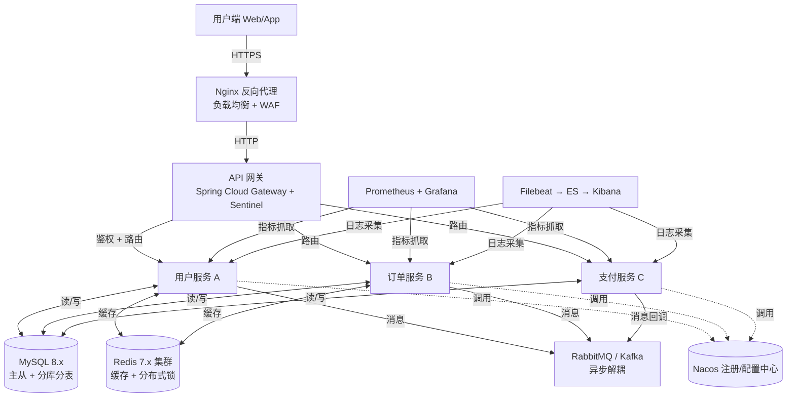

# 技术方案文档模板

## 1. 文档说明

| 属性 | 说明 |
|------|------|
| 文档版本 | V1.0 |
| 生效日期 | 2026-08-15 |
| 适用范围 | 公司所有技术方案设计文档（含架构方案、技术改造、中间件选型等） |
| 作者 | 架构组 |

---

## 2. 模板使用说明

本模板为 **技术方案评审的强制交付物**。**使用方法**：
1. 将本文件复制到 `docs/03-技术笔记/架构设计/` 下，命名建议：`<方案主题>.md`
2. 严格按照章节顺序填写；不适用的小节写「不适用」并说明原因，**禁止删除章节**
3. 所有 `<!-- 使用者请替换：xxx -->` 注释替换为实际内容
4. 方案评审会前上传本文档到 MR，所有评审人提前阅读

---

## 3. 背景与目标

### 3.1 业务背景

<!-- 使用者请替换：
  - 描述业务发展的现状（如：「当前用户量 X，日订单量 Y，月增长 Z%」）
  - 用数据说明「为什么现在必须做这个方案」
  - 业务方明确的时间窗口 / 合规要求
-->
示例：
> 随着 XX 业务高速增长，当前 XX 系统月活用户从 2026 年 Q1 的 10 万增长至 Q2 的 50 万，核心接口 P95 响应时间从 80ms 劣化到 600ms，OOM 告警每周出现 3~5 次。业务侧规划 Q3 末用户量突破 100 万，现有架构已无法承载。

### 3.2 现存问题与痛点

| 序号 | 问题描述 | 影响范围 | 当前严重度（1~5，5 最高） | 可量化指标 |
|------|---------|---------|--------------------------|-----------|
| 1 | <!-- 使用者请替换：具体问题 --> | | | |
| 2 | | | | |
| 3 | | | | |

### 3.3 设计目标

**【SMART 原则】** Specific（具体）、Measurable（可衡量）、Achievable（可实现）、Relevant（相关）、Time-bound（有时限）。

#### 功能性目标

| 编号 | 目标描述 | 验收标准 |
|------|---------|---------|
| F1 | <!-- 使用者请替换：例如 「支持用户批量导入（单次 1 万条）」 --> | 1 万条导入 ≤ 30 秒，失败行返回明细 |
| F2 | | |
| F3 | | |

#### 非功能性目标（质量属性）

| 编号 | 维度 | 目标描述 | 验收标准 |
|------|------|---------|---------|
| NF1 | 性能 | <!-- 使用者请替换：核心接口 P95 响应时间 --> | P95 ≤ 150ms，P99 ≤ 300ms |
| NF2 | 可用性 | 全年可用性 ≥ 99.95% | 年度不可用时间 ≤ 4.38 小时 |
| NF3 | 并发量 | 支撑 QPS / TPS | 峰值 QPS ≥ 5000，压测通过 |
| NF4 | 扩展性 | 水平扩展能力 | 节点数从 2 → 8 时，吞吐量线性度 ≥ 80% |
| NF5 | 可维护性 | 构建时间 / 启动时间 | 冷启动 ≤ 30 秒（JDK 25 虚拟线程 + CRaC 可选） |
| NF6 | 安全合规 | 等保 / GDPR / 其他法规要求 | 通过等保三级测评 |

### 3.4 约束条件

| 类型 | 约束描述 |
|------|---------|
| 技术栈约束 | 必须使用公司已定义的技术栈（JDK 25 / Spring Boot 4.x / React 19 等，参考 [技术栈表](../README.md#技术栈要求)） |
| 历史包袱约束 | <!-- 使用者请替换：如「老系统 XX 模块仍在运行，必须兼容现有接口 3 个月」 --> |
| 合规约束 | <!-- 使用者请替换：如「数据必须存于国内节点，满足《数据安全法》」 --> |
| 时间窗口 | 必须在 YYYY-MM-DD 前上线（配合 XX 活动 / 监管截止期） |
| 人员约束 | <!-- 使用者请替换：如「可用人力 2 后端 + 1 前端，共 6 周」 --> |
| 预算约束 | <!-- 使用者请替换：如「服务器预算每月 ≤ X 元」 --> |
| 其他约束 | |

---

## 4. 备选方案列表

> **铁律**：方案设计必须至少给出 2 个备选方案，禁止只给一个方案就直接「推荐方案 A」。
> 方案 A 可极端保守（「什么都不改+堆机器」），方案 B 可激进，方案 C 可折中，然后用数据对比选出最优解。

| 方案 | 名称 | 一句话描述 | 典型适用场景 |
|------|------|-----------|------------|
| 方案 A | 保守方案 / 堆硬件方案 | <!-- 使用者请替换：如「维持现有单体，从 2 台 4C8G 扩容到 8 台 8C16G」 --> | 时间极紧、预算充足、无架构改造人力 |
| 方案 B | 折中方案 / 渐进式改造 | <!-- 使用者请替换：如「按 DDD 拆分用户/订单模块，模块化改造」 --> | 通用大部分场景，稳步推进 |
| 方案 C | 激进方案 / 面向未来方案 | <!-- 使用者请替换：如「全面微服务化 + Service Mesh + 事件驱动」 --> | 未来 3 年业务高增长、团队技术储备充足 |

---

## 5. 多维度方案对比

### 5.1 量化对比表（不少于 6 个维度）

| 对比维度 | 权重 | 方案 A（保守） | 方案 B（折中） | 方案 C（激进） |
|---------|------|-------------|-------------|-------------|
| **开发成本**（人日） | 20% | <!-- 例如 10 人日 --> | | |
| **上线时间** | 20% | 例如 1 周 | | |
| **性能提升**（P95 降幅） | 15% | 例如 0%（靠堆硬件支撑） | | |
| **长期维护复杂度** | 15% | 例如 低（单体简单）→ 高（长期技术债） | | |
| **与现有系统兼容度** | 10% | 例如 高（零改造） | | |
| **故障恢复能力**（RTO/RPO） | 10% | 例如 RTO 2 小时 | | |
| **可扩展性（未来 3 年）** | 10% | 例如 低（单体上限） | | |
| **加权总分** | **100%** | （自动计算） | | |

> **打分规则**：每项 1~10 分，加权求和，分数越高越好。

### 5.2 各方案详细优劣势分析

#### 方案 A：保守方案
- **优势（Pros）**：
  1. 
  2. 
- **劣势（Cons）**：
  1. 
  2. 
- **适用条件**：仅在 XXX 极端条件下考虑

#### 方案 B：折中方案
- **优势（Pros）**：
  1. 
  2. 
- **劣势（Cons）**：
  1. 
  2. 

#### 方案 C：激进方案
- **优势（Pros）**：
  1. 
  2. 
- **劣势（Cons）**：
  1. 
  2. 

### 5.3 方案选型结论

**推荐方案：方案 B（折中方案）**

**核心理由（至少 3 条，必须引用 §5.1 对比表数据）**：
1. 在「开发成本 × 权重 20%」维度，方案 B 仅比方案 A 高 15 人日，但……
2. 在「可扩展性 × 权重 10%」维度，方案 C 虽得满分，但「上线时间」维度超标 ……
3. 综合加权总分：B > C > A，且 B 满足所有约束条件（§3.4）

**放弃方案 A 的原因**：
**放弃方案 C 的原因**：

---

## 6. 详细设计

### 6.1 总体架构设计

> 【强制】必须包含架构图；Mermaid 语法首选，复杂图可后续补图片到 assets 目录。

<!-- 使用者请替换：以上为微服务通用参考架构，请根据你的方案重画 -->

**架构图文字说明**（即使图不渲染，以下文字也能传达核心结构）：
- 流量入口：用户 → HTTPS → Nginx（WAF + 四层 LB）→ API 网关
- 服务拆分：网关后按领域拆分为用户/订单/支付 3 个微服务（以上仅为示例）
- 数据层：MySQL 主从 + Redis 集群 + MQ 异步解耦
- 可观测：全链路 Prometheus 指标 + ELK 日志
- 服务治理：Nacos 统一注册配置 + Sentinel 限流熔断

### 6.2 核心模块职责表

| 模块名称 | 职责边界（这个模块做什么 / 不做什么） | 关键对外接口 | 负责人 |
|---------|-----------------------------------|------------|--------|
| <!-- 使用者请替换：网关模块 --> | 路由转发、统一鉴权、限流、灰度发布；**不做**业务逻辑聚合 | 路由配置 API、限流规则 API | |
| | | | |
| | | | |

### 6.3 数据设计

> 参考完整模板：[数据库设计文档模板](../04-项目模板/数据库设计文档模板.md)

#### 6.3.1 新增/变更的核心表（表结构摘要）

| 表名 | 用途 | 核心字段（仅列关键字段） | 预估数据量（3年） |
|------|------|------------------------|----------------|
| <!-- 使用者请替换：`t_order` --> | 订单主表 | order_id, user_id, status, amount, create_time | 约 5000 万行 |
| | | | |

#### 6.3.2 缓存设计

| 缓存 Key 模式 | 数据结构 | TTL | 更新策略 | 穿透/击穿防护 |
|--------------|---------|-----|---------|--------------|
| `user:info:{userId}` | String (JSON) | 30 分钟 | Cache Aside（写 DB 后删缓存） | 空值缓存 30 秒 |
| <!-- 使用者请替换： --> | | | | |

#### 6.3.3 数据流转 / 消息设计

| 消息主题 Topic | 生产者 | 消费者 | 消息载荷（关键字段） | 可靠性保证 |
|--------------|--------|--------|-------------------|----------|
| `order.created` | 订单服务 | 库存服务 + 积分服务 | orderId, userId, amount, items[] | 持久化 + ACK 重试 + 死信队列 |
| <!-- 使用者请替换： --> | | | | |

### 6.4 接口设计

> 涉及 **外部 HTTP API** 的，完整接口文档在 [API-接口文档模板](../04-项目模板/API-接口文档模板.md) 中维护，本节仅列 **新增/变更的核心接口摘要**。

| 接口 | Method | 路径 | 功能说明 | 与原有接口的兼容性 |
|------|--------|------|---------|-----------------|
| <!-- 使用者请替换： --> | | | | 新增接口（无兼容问题） / 兼容老接口 / 不兼容需升级版本号 |
| | | | | |

**内部服务间调用（Feign / RPC）**：
| 调用方 → 被调方 | 接口方法 | 超时/重试策略 | 降级方案 |
|----------------|---------|-------------|---------|
| 订单服务 → 用户服务 | 查询用户收货地址 | 1s 超时，重试 1 次 | 降级返回默认地址 + 告警 |

### 6.5 异常处理与降级策略

| 异常场景 | 触发条件 | 系统行为 | 用户感知 | 告警级别 |
|---------|---------|---------|---------|---------|
| DB 连接池耗尽 | HikariCP active = max（如 50/50）持续 10 秒 | 1. 拒绝新请求返回 `50001`；2. 输出线程堆栈日志 | 前端展示「服务繁忙」 | P1 电话告警 |
| 下游用户服务超时（>1s） | Feign 连续 3 次超时 | 触发 Sentinel 降级，返回本地缓存默认值 | 展示兜底数据（不阻断核心链路） | P2 IM 告警 |
| MQ 消费积压 | Lag > 10000 且持续增长 | 1. 扩容消费者实例；2. 临时关闭非核心消费组 | 用户无感知 | P2 告警 |
| <!-- 使用者请替换： --> | | | | |

### 6.6 部署方案

#### 6.6.1 部署架构图 / 资源配置

| 服务节点 | K8s 部署规格（容器资源） | 最小副本数 | 弹性伸缩规则（HPA） |
|---------|----------------------|----------|-------------------|
| 网关服务 | 2C4G × 容器 | 2 | CPU > 60% 自动扩容，最大 8 副本 |
| 用户服务 | 4C8G × 容器 | 2 | CPU > 70% 或 QPS > 2000 自动扩容，最大 16 |
| MySQL（云数据库） | 8C32G 主 + 8C32G 从 × 2 | - | 磁盘使用率 > 70% 自动扩容磁盘 |
| Redis（云缓存） | 8G 集群 3 主 3 从 | - | - |
| <!-- 使用者请替换： --> | | | |

#### 6.6.2 灰度发布策略
参考 [部署与运维规范](../02-部署运维/部署与运维规范.md) §4：
- **发布批次**：5%（观察 15 分钟） → 20%（30 分钟） → 50%（1 小时） → 100%
- **每阶段必观测指标**：核心接口错误率 < 0.1%、P95 延迟 < 基线 120%、无 P1/P0 告警
- **回滚触发条件**：任意阶段出现错误率 > 1% 或 核心指标劣化 50% 以上，立即一键回滚

---

## 7. 风险评估与应对

| 编号 | 风险描述 | 发生概率（高/中/低） | 业务影响（高/中/低） | 风险等级 | 缓解措施 / 应急预案 | 责任人 |
|------|---------|-------------------|-------------------|---------|-------------------|--------|
| R1 | <!-- 使用者请替换：方案复杂度高，开发周期超预期 --> | 中 | 高 | 🟠 高 | 1. 方案拆解为 Phase 1/2，Phase 1 先满足最低目标上线； 2. 预留 20% Buffer 时间； 3. 周粒度进度评审 | 方案负责人 |
| R2 | <!-- 使用者请替换：与历史遗留接口不兼容 --> | 中 | 高 | 🟠 高 | 1. 上线前编写兼容性测试用例，覆盖所有旧版本客户端； 2. 灰度期间保留旧接口，放量至 100% 稳定 3 天后下线 | TL |
| R3 | 数据迁移过程中发生数据丢失或不一致 | 低 | 极高 | 🔴 极高 | 1. 迁移脚本 3 轮演练（全量 + 增量校验 MD5）； 2. 迁移期间双写，回滚点清晰； 3. 迁移前全量备份 + 快照 | DBA |
| R4 | <!-- 使用者请替换：团队对新技术（如 G1 GC 参数调优）经验不足 --> | 中 | 中 | 🟡 中 | 1. 提前 2 周做技术分享和 POC； 2. 引入外部专家做 1 次评审； 3. 生产默认使用保守参数模板 | 架构师 |
| R5 | 上线窗口期恰逢大促 / 节假日高峰 | 低 | 高 | 🟠 高 | 1. 严格避开活动前 1 周； 2. 如时间窗口重叠，提前与业务方协商调整方案 | PM |
| R6 | 依赖的开源中间件版本存在已知未修复漏洞 | 低 | 中 | 🟡 中 | 1. 启动前做 CVE 扫描（Trivy / OWASP Dependency-Check）； 2. 锁定已修复漏洞的最小版本，禁止浮动版本 | SRE |

---

## 8. 分阶段实施路径（里程碑）

| 阶段 | 时间范围 | 核心交付物 | 验收标准 | 负责人 |
|------|---------|-----------|---------|--------|
| **Phase 1：方案细化 + POC** | Week 1 | 细化设计文档、POC 性能报告、选型确认 | 文档通过架构组评审；POC 指标达到 §3.3 NF 目标 80% | 架构师 |
| **Phase 2：开发联调** | Week 2 ~ Week 4 | 可运行的完整功能（含单元测试覆盖率 ≥ 70%） | 接口联调通过率 100%；无阻断级 Bug | TL |
| **Phase 3：测试验收** | Week 5 | 测试报告（功能 + 性能 + 安全） | 功能测试 0 Blocker；压测达到 QPS 目标；通过安全扫描 | 测试 TL |
| **Phase 4：灰度上线** | Week 6 Day 1~3 | 灰度环境 5% → 20% → 50% → 100% | 每阶段观察指标符合 §6.6.2 要求 | 发布负责人 |
| **Phase 5：稳定 + 复盘** | Week 6 Day 4~7 | 上线复盘报告（问题 + Action Item） | 连续 3 天无 P0/P1 告警；复盘 Action 100% 跟进 | 全体 |

---

## 9. 与其他方案/系统的依赖关系

| 依赖项目 | 依赖内容 | 当前状态（已完成/进行中/未启动） | 风险点 | 对接人 |
|---------|---------|------------------------------|--------|--------|
| <!-- 使用者请替换：统一认证中心 --> | 需要接入 SSO 登录 | 进行中（预计 Week 3 可用） | 认证延期会阻塞 Phase 2 联调 | XXX |
| | | | | |

---

## 10. 落地检查清单（方案评审必过项）

| 序号 | 检查项 | 级别 | 评审时是否达标 |
|------|--------|------|-------------|
| 1 | §3 背景与目标是否满足 SMART 原则（目标可量化、有时间线） | 强制 | ⬜ |
| 2 | §3.4 约束条件是否经业务方确认签字 | 强制 | ⬜ |
| 3 | §4 是否给出了至少 2 个备选方案（禁止单一方案） | 强制 | ⬜ |
| 4 | §5.1 对比维度是否 ≥ 6 个，方案评分是否有量化依据（非拍脑袋） | 强制 | ⬜ |
| 5 | §5.3 放弃方案 A/C 的原因是否明确、无逻辑漏洞 | 强制 | ⬜ |
| 6 | §6.1 架构图是否绘制 + 文字描述是否双重保险 | 推荐 | ⬜ |
| 7 | §6.3 数据设计是否列出了所有新增表 + 缓存 Key（禁止遗漏导致的线上问题） | 强制 | ⬜ |
| 8 | §6.6 资源配置是否经 SRE 确认（CPU/内存/副本数是否符合实际压测） | 强制 | ⬜ |
| 9 | §7 风险评估是否 ≥ 4 项，且每项都有可执行的缓解措施（非空话） | 强制 | ⬜ |
| 10 | §8 里程碑是否有明确的「验收标准」+「负责人」 | 强制 | ⬜ |
| 11 | 本方案是否涉及线上数据迁移？如有，是否有独立的《数据迁移方案》附件 | 强制（视场景） | ⬜ |
| 12 | 本方案是否符合公司 [命名规范](../00-开发规范/命名规范.md) / [安全规范](../00-开发规范/安全开发规范.md) | 强制 | ⬜ |

---

**文档结束**

*本文档由 pangpang-doc 维护，解释权归架构组所有。*
