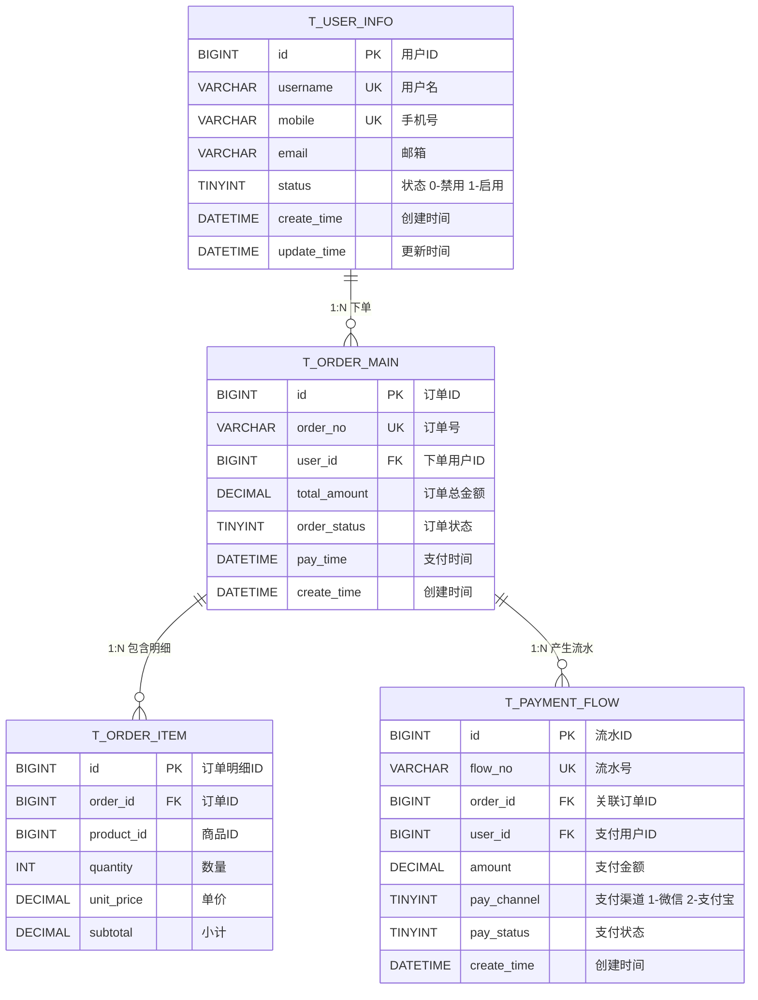

# 数据库设计文档模板

## 1. 文档说明

| 属性 | 说明 |
|------|------|
| 文档版本 | V1.0 |
| 生效日期 | 2026-08-15 |
| 适用范围 | 所有需要进行数据库设计的后端项目 |
| 作者 | 架构组 |

> **使用提示**：本文档为数据库设计的标准模板。使用者请将 `<!-- -->` 注释中的提示内容替换为项目真实信息，删除示例表结构，填写实际的表设计。

---

## 2. 设计概述

### 2.1 设计目标

<!-- 使用者请替换：描述本次数据库设计要解决的业务问题，例如"支撑用户中心模块的用户注册、登录、权限管理" -->

- 支撑 `{业务模块}` 的数据持久化需求
- 保证数据一致性、完整性、可扩展性
- 满足性能要求：单表查询 P99 < 50ms，关联查询 P99 < 200ms

### 2.2 设计原则

#### 【强制】命名规范

| 对象类型 | 命名规则 | 示例 |
|---------|---------|------|
| 表名 | 小写蛇形，业务前缀 + 实体名，复数形式 | `t_user_info`、`t_order_item` |
| 字段名 | 小写蛇形，见名知义 | `user_id`、`create_time` |
| 索引名 | `idx_{表名缩写}_{字段名}` 或 `uk_{表名缩写}_{字段名}` | `idx_ui_mobile`、`uk_ui_username` |
| 主键 | 统一命名 `id`，BIGINT 自增或雪花 ID | `id BIGINT PRIMARY KEY` |

#### 【强制】字符集与引擎

| 参数 | 约定值 | 说明 |
|------|-------|------|
| 数据库字符集 | `utf8mb4` | 支持完整 Unicode，包含 emoji |
| 排序规则 | `utf8mb4_general_ci` | 通用大小写不敏感排序 |
| 存储引擎 | `InnoDB` | 支持事务、行级锁、外键 |
| 行格式 | `DYNAMIC` | MySQL 8.0 默认，支持大字段高效存储 |

#### 【推荐】通用字段规范

每张业务表 **必须包含** 以下 5 个通用字段：

| 字段名 | 类型 | 说明 | 约束 |
|--------|------|------|------|
| `id` | `BIGINT` | 主键 | `PRIMARY KEY AUTO_INCREMENT` 或雪花 ID |
| `create_time` | `DATETIME(3)` | 创建时间 | `NOT NULL DEFAULT CURRENT_TIMESTAMP(3)` |
| `update_time` | `DATETIME(3)` | 更新时间 | `NOT NULL DEFAULT CURRENT_TIMESTAMP(3) ON UPDATE CURRENT_TIMESTAMP(3)` |
| `create_by` | `VARCHAR(64)` | 创建人 | 可空，存用户 ID 或用户名 |
| `update_by` | `VARCHAR(64)` | 更新人 | 可空，存用户 ID 或用户名 |

> 逻辑删除字段：若表需要软删除，追加 `is_deleted TINYINT NOT NULL DEFAULT 0 COMMENT '0-未删除 1-已删除'`，并建联合索引。

---

## 3. ER 图说明

> 下图为 **ER 关系示意骨架**，使用者请替换实体和关系为项目真实设计。若 Mermaid 无法渲染，请参考下方文字说明。



**核心关系文字说明**（图无法渲染时参考）：

| 关系 | 类型 | 说明 |
|------|------|------|
| 用户 → 订单 | 1:N | 一个用户可下多个订单，`t_order_main.user_id` 外键关联 |
| 订单 → 订单明细 | 1:N | 一个订单包含多条商品明细，`t_order_item.order_id` 外键关联 |
| 订单 → 支付流水 | 1:N | 一个订单可能产生多笔支付流水（重试、退款），`t_payment_flow.order_id` 关联 |

---

## 4. 表结构详情

> 以下为 **3 张示例表**，展示标准表设计的完整结构。使用者请删除示例，替换为项目真实表。

### 4.1 用户表 `t_user_info`

#### 4.1.1 字段清单

| 序号 | 字段名 | 类型 | 长度/精度 | 可空 | 默认值 | 主键 | 说明 |
|------|--------|------|----------|------|--------|------|------|
| 1 | `id` | `BIGINT` | - | NO | `AUTO_INCREMENT` | ✅ | 用户主键 ID |
| 2 | `username` | `VARCHAR` | 64 | NO | - | - | 用户名，全局唯一 |
| 3 | `password_hash` | `VARCHAR` | 255 | NO | - | - | BCrypt 加密后的密码哈希 |
| 4 | `mobile` | `VARCHAR` | 20 | YES | `NULL` | - | 手机号，国家码 + 号码 |
| 5 | `email` | `VARCHAR` | 128 | YES | `NULL` | - | 邮箱地址 |
| 6 | `nickname` | `VARCHAR` | 64 | YES | `NULL` | - | 昵称/展示名 |
| 7 | `avatar_url` | `VARCHAR` | 512 | YES | `NULL` | - | 头像 URL |
| 8 | `status` | `TINYINT` | - | NO | `1` | - | 状态：0-禁用，1-正常，2-锁定 |
| 9 | `last_login_time` | `DATETIME(3)` | - | YES | `NULL` | - | 最近一次登录时间 |
| 10 | `last_login_ip` | `VARCHAR` | 45 | YES | `NULL` | - | 最近登录 IP（支持 IPv6） |
| 11 | `is_deleted` | `TINYINT` | - | NO | `0` | - | 逻辑删除：0-未删，1-已删 |
| 12 | `create_time` | `DATETIME(3)` | - | NO | `CURRENT_TIMESTAMP(3)` | - | 创建时间 |
| 13 | `update_time` | `DATETIME(3)` | - | NO | `CURRENT_TIMESTAMP(3)` | - | 更新时间 |
| 14 | `create_by` | `VARCHAR` | 64 | YES | `NULL` | - | 创建人 |
| 15 | `update_by` | `VARCHAR` | 64 | YES | `NULL` | - | 更新人 |

#### 4.1.2 索引说明

| 索引名 | 类型 | 字段 | 说明 |
|--------|------|------|------|
| `PRIMARY` | 主键 | `id` | 聚簇索引 |
| `uk_ui_username` | 唯一索引 | `username`, `is_deleted` | 用户名唯一（逻辑删除后用户名可复用） |
| `uk_ui_mobile` | 唯一索引 | `mobile`, `is_deleted` | 手机号唯一 |
| `idx_ui_email` | 普通索引 | `email` | 邮箱登录/查询加速 |
| `idx_ui_status` | 普通索引 | `status` | 按状态筛选用户 |
| `idx_ui_create_time` | 普通索引 | `create_time` | 按注册时间排序/范围查询 |

#### 4.1.3 约束说明

| 约束名 | 类型 | 内容 |
|--------|------|------|
| `chk_ui_status` | CHECK | `status IN (0, 1, 2)` |
| `chk_ui_mobile_format` | CHECK（可选） | `mobile REGEXP '^\\+?[0-9]{6,20}$'`（应用层校验优先） |

#### 4.1.4 DDL 语句

```sql
CREATE TABLE `t_user_info` (
    `id`              BIGINT        NOT NULL AUTO_INCREMENT COMMENT '用户主键ID',
    `username`        VARCHAR(64)   NOT NULL COMMENT '用户名，全局唯一',
    `password_hash`   VARCHAR(255)  NOT NULL COMMENT 'BCrypt加密后的密码哈希',
    `mobile`          VARCHAR(20)   DEFAULT NULL COMMENT '手机号，国家码+号码',
    `email`           VARCHAR(128)  DEFAULT NULL COMMENT '邮箱地址',
    `nickname`        VARCHAR(64)   DEFAULT NULL COMMENT '昵称/展示名',
    `avatar_url`      VARCHAR(512)  DEFAULT NULL COMMENT '头像URL',
    `status`          TINYINT       NOT NULL DEFAULT 1 COMMENT '状态：0-禁用 1-正常 2-锁定',
    `last_login_time` DATETIME(3)   DEFAULT NULL COMMENT '最近一次登录时间',
    `last_login_ip`   VARCHAR(45)   DEFAULT NULL COMMENT '最近登录IP（支持IPv6）',
    `is_deleted`      TINYINT       NOT NULL DEFAULT 0 COMMENT '逻辑删除：0-未删 1-已删',
    `create_time`     DATETIME(3)   NOT NULL DEFAULT CURRENT_TIMESTAMP(3) COMMENT '创建时间',
    `update_time`     DATETIME(3)   NOT NULL DEFAULT CURRENT_TIMESTAMP(3) ON UPDATE CURRENT_TIMESTAMP(3) COMMENT '更新时间',
    `create_by`       VARCHAR(64)   DEFAULT NULL COMMENT '创建人',
    `update_by`       VARCHAR(64)   DEFAULT NULL COMMENT '更新人',
    PRIMARY KEY (`id`),
    UNIQUE KEY `uk_ui_username` (`username`, `is_deleted`),
    UNIQUE KEY `uk_ui_mobile` (`mobile`, `is_deleted`),
    KEY `idx_ui_email` (`email`),
    KEY `idx_ui_status` (`status`),
    KEY `idx_ui_create_time` (`create_time`)
) ENGINE = InnoDB
  DEFAULT CHARSET = utf8mb4
  COLLATE = utf8mb4_general_ci
  ROW_FORMAT = DYNAMIC
  COMMENT ='用户信息表';
```

---

### 4.2 订单主表 `t_order_main`

#### 4.2.1 字段清单

| 序号 | 字段名 | 类型 | 长度/精度 | 可空 | 默认值 | 主键 | 说明 |
|------|--------|------|----------|------|--------|------|------|
| 1 | `id` | `BIGINT` | - | NO | - | ✅ | 订单主键 ID（雪花算法生成） |
| 2 | `order_no` | `VARCHAR` | 32 | NO | - | - | 业务订单号，全局唯一 |
| 3 | `user_id` | `BIGINT` | - | NO | - | - | 下单用户 ID |
| 4 | `total_amount` | `DECIMAL` | 12,2 | NO | `0.00` | - | 订单总金额（元） |
| 5 | `pay_amount` | `DECIMAL` | 12,2 | NO | `0.00` | - | 实付金额（元） |
| 6 | `discount_amount` | `DECIMAL` | 12,2 | NO | `0.00` | - | 优惠金额（元） |
| 7 | `freight_amount` | `DECIMAL` | 10,2 | NO | `0.00` | - | 运费（元） |
| 8 | `order_status` | `TINYINT` | - | NO | `10` | - | 订单状态：10-待支付 20-已支付 30-已发货 40-已完成 50-已取消 |
| 9 | `pay_channel` | `TINYINT` | - | YES | `NULL` | - | 支付渠道：1-微信 2-支付宝 3-银行卡 |
| 10 | `pay_time` | `DATETIME(3)` | - | YES | `NULL` | - | 支付完成时间 |
| 11 | `consignee_name` | `VARCHAR` | 64 | NO | - | - | 收货人姓名 |
| 12 | `consignee_mobile` | `VARCHAR` | 20 | NO | - | - | 收货人手机号 |
| 13 | `consignee_address` | `VARCHAR` | 512 | NO | - | - | 收货完整地址 |
| 14 | `remark` | `VARCHAR` | 512 | YES | `NULL` | - | 订单备注 |
| 15 | `cancel_reason` | `VARCHAR` | 255 | YES | `NULL` | - | 取消原因 |
| 16 | `cancel_time` | `DATETIME(3)` | - | YES | `NULL` | - | 取消时间 |
| 17 | `finish_time` | `DATETIME(3)` | - | YES | `NULL` | - | 订单完成时间 |
| 18 | `create_time` | `DATETIME(3)` | - | NO | `CURRENT_TIMESTAMP(3)` | - | 创建时间 |
| 19 | `update_time` | `DATETIME(3)` | - | NO | `CURRENT_TIMESTAMP(3)` | - | 更新时间 |
| 20 | `create_by` | `VARCHAR` | 64 | YES | `NULL` | - | 创建人 |
| 21 | `update_by` | `VARCHAR` | 64 | YES | `NULL` | - | 更新人 |

#### 4.2.2 索引说明

| 索引名 | 类型 | 字段 | 说明 |
|--------|------|------|------|
| `PRIMARY` | 主键 | `id` | 聚簇索引 |
| `uk_om_order_no` | 唯一索引 | `order_no` | 订单号全局唯一 |
| `idx_om_user_status` | 联合索引 | `user_id`, `order_status` | 用户订单列表查询（按状态筛选） |
| `idx_om_create_time` | 普通索引 | `create_time` | 按创建时间范围查询、统计报表 |
| `idx_om_status` | 普通索引 | `order_status` | 后台按状态筛选订单 |
| `idx_om_pay_status_time` | 联合索引 | `order_status`, `pay_time` | 已支付订单统计、超时未支付扫描 |

#### 4.2.3 DDL 语句

```sql
CREATE TABLE `t_order_main` (
    `id`                BIGINT        NOT NULL COMMENT '订单主键ID（雪花算法）',
    `order_no`          VARCHAR(32)   NOT NULL COMMENT '业务订单号',
    `user_id`           BIGINT        NOT NULL COMMENT '下单用户ID',
    `total_amount`      DECIMAL(12,2) NOT NULL DEFAULT 0.00 COMMENT '订单总金额',
    `pay_amount`        DECIMAL(12,2) NOT NULL DEFAULT 0.00 COMMENT '实付金额',
    `discount_amount`   DECIMAL(12,2) NOT NULL DEFAULT 0.00 COMMENT '优惠金额',
    `freight_amount`    DECIMAL(10,2) NOT NULL DEFAULT 0.00 COMMENT '运费',
    `order_status`      TINYINT       NOT NULL DEFAULT 10 COMMENT '订单状态 10-待支付 20-已支付 30-已发货 40-已完成 50-已取消',
    `pay_channel`       TINYINT       DEFAULT NULL COMMENT '支付渠道 1-微信 2-支付宝 3-银行卡',
    `pay_time`          DATETIME(3)   DEFAULT NULL COMMENT '支付完成时间',
    `consignee_name`    VARCHAR(64)   NOT NULL COMMENT '收货人姓名',
    `consignee_mobile`  VARCHAR(20)   NOT NULL COMMENT '收货人手机号',
    `consignee_address` VARCHAR(512)  NOT NULL COMMENT '收货完整地址',
    `remark`            VARCHAR(512)  DEFAULT NULL COMMENT '订单备注',
    `cancel_reason`     VARCHAR(255)  DEFAULT NULL COMMENT '取消原因',
    `cancel_time`       DATETIME(3)   DEFAULT NULL COMMENT '取消时间',
    `finish_time`       DATETIME(3)   DEFAULT NULL COMMENT '订单完成时间',
    `create_time`       DATETIME(3)   NOT NULL DEFAULT CURRENT_TIMESTAMP(3) COMMENT '创建时间',
    `update_time`       DATETIME(3)   NOT NULL DEFAULT CURRENT_TIMESTAMP(3) ON UPDATE CURRENT_TIMESTAMP(3) COMMENT '更新时间',
    `create_by`         VARCHAR(64)   DEFAULT NULL COMMENT '创建人',
    `update_by`         VARCHAR(64)   DEFAULT NULL COMMENT '更新人',
    PRIMARY KEY (`id`),
    UNIQUE KEY `uk_om_order_no` (`order_no`),
    KEY `idx_om_user_status` (`user_id`, `order_status`),
    KEY `idx_om_create_time` (`create_time`),
    KEY `idx_om_status` (`order_status`),
    KEY `idx_om_pay_status_time` (`order_status`, `pay_time`)
) ENGINE = InnoDB
  DEFAULT CHARSET = utf8mb4
  COLLATE = utf8mb4_general_ci
  ROW_FORMAT = DYNAMIC
  COMMENT ='订单主表';
```

---

### 4.3 支付流水表 `t_payment_flow`

#### 4.3.1 字段清单

| 序号 | 字段名 | 类型 | 长度/精度 | 可空 | 默认值 | 主键 | 说明 |
|------|--------|------|----------|------|--------|------|------|
| 1 | `id` | `BIGINT` | - | NO | - | ✅ | 流水主键 ID |
| 2 | `flow_no` | `VARCHAR` | 48 | NO | - | - | 业务流水号，全局唯一 |
| 3 | `order_id` | `BIGINT` | - | NO | - | - | 关联订单 ID |
| 4 | `user_id` | `BIGINT` | - | NO | - | - | 支付用户 ID |
| 5 | `amount` | `DECIMAL` | 12,2 | NO | `0.00` | - | 交易金额 |
| 6 | `flow_type` | `TINYINT` | - | NO | - | - | 流水类型：1-支付 2-退款 3-提现 |
| 7 | `pay_channel` | `TINYINT` | - | NO | - | - | 支付渠道：1-微信 2-支付宝 |
| 8 | `channel_flow_no` | `VARCHAR` | 128 | YES | `NULL` | - | 第三方渠道流水号 |
| 9 | `pay_status` | `TINYINT` | - | NO | `10` | - | 支付状态：10-待支付 20-成功 30-失败 40-已关闭 |
| 10 | `client_ip` | `VARCHAR` | 45 | YES | `NULL` | - | 支付请求客户端 IP |
| 11 | `success_time` | `DATETIME(3)` | - | YES | `NULL` | - | 支付成功时间 |
| 12 | `fail_reason` | `VARCHAR` | 512 | YES | `NULL` | - | 失败原因 |
| 13 | `callback_raw` | `JSON` | - | YES | `NULL` | - | 第三方回调原始报文（JSON 格式） |
| 14 | `create_time` | `DATETIME(3)` | - | NO | `CURRENT_TIMESTAMP(3)` | - | 创建时间 |
| 15 | `update_time` | `DATETIME(3)` | - | NO | `CURRENT_TIMESTAMP(3)` | - | 更新时间 |

#### 4.3.2 索引说明

| 索引名 | 类型 | 字段 | 说明 |
|--------|------|------|------|
| `PRIMARY` | 主键 | `id` | 聚簇索引 |
| `uk_pf_flow_no` | 唯一索引 | `flow_no` | 业务流水号唯一 |
| `uk_pf_channel_flow` | 唯一索引 | `pay_channel`, `channel_flow_no` | 防止第三方重复回调 |
| `idx_pf_order_id` | 普通索引 | `order_id` | 查某订单的所有流水 |
| `idx_pf_user_create` | 联合索引 | `user_id`, `create_time` | 用户按时间查流水 |
| `idx_pf_status_create` | 联合索引 | `pay_status`, `create_time` | 扫待处理流水、成功率统计 |

#### 4.3.3 DDL 语句

```sql
CREATE TABLE `t_payment_flow` (
    `id`                BIGINT        NOT NULL COMMENT '流水主键ID',
    `flow_no`           VARCHAR(48)   NOT NULL COMMENT '业务流水号',
    `order_id`          BIGINT        NOT NULL COMMENT '关联订单ID',
    `user_id`           BIGINT        NOT NULL COMMENT '支付用户ID',
    `amount`            DECIMAL(12,2) NOT NULL DEFAULT 0.00 COMMENT '交易金额',
    `flow_type`         TINYINT       NOT NULL COMMENT '流水类型 1-支付 2-退款 3-提现',
    `pay_channel`       TINYINT       NOT NULL COMMENT '支付渠道 1-微信 2-支付宝',
    `channel_flow_no`   VARCHAR(128)  DEFAULT NULL COMMENT '第三方渠道流水号',
    `pay_status`        TINYINT       NOT NULL DEFAULT 10 COMMENT '支付状态 10-待支付 20-成功 30-失败 40-已关闭',
    `client_ip`         VARCHAR(45)   DEFAULT NULL COMMENT '支付请求客户端IP',
    `success_time`      DATETIME(3)   DEFAULT NULL COMMENT '支付成功时间',
    `fail_reason`       VARCHAR(512)  DEFAULT NULL COMMENT '失败原因',
    `callback_raw`      JSON          DEFAULT NULL COMMENT '第三方回调原始报文',
    `create_time`       DATETIME(3)   NOT NULL DEFAULT CURRENT_TIMESTAMP(3) COMMENT '创建时间',
    `update_time`       DATETIME(3)   NOT NULL DEFAULT CURRENT_TIMESTAMP(3) ON UPDATE CURRENT_TIMESTAMP(3) COMMENT '更新时间',
    PRIMARY KEY (`id`),
    UNIQUE KEY `uk_pf_flow_no` (`flow_no`),
    UNIQUE KEY `uk_pf_channel_flow` (`pay_channel`, `channel_flow_no`),
    KEY `idx_pf_order_id` (`order_id`),
    KEY `idx_pf_user_create` (`user_id`, `create_time`),
    KEY `idx_pf_status_create` (`pay_status`, `create_time`)
) ENGINE = InnoDB
  DEFAULT CHARSET = utf8mb4
  COLLATE = utf8mb4_general_ci
  ROW_FORMAT = DYNAMIC
  COMMENT ='支付流水表';
```

---

## 5. 数据字典

> 本章节将所有表的 **枚举字段** 集中管理，方便开发、测试、产品统一认知。使用者请按需扩展。

| 所属表 | 字段名 | 枚举值 | 含义 | 说明 |
|--------|--------|--------|------|------|
| `t_user_info` | `status` | 0 | 禁用 | 用户被管理员禁用 |
| | | 1 | 正常 | 默认值，可正常登录使用 |
| | | 2 | 锁定 | 连续登录失败触发锁定，到期自动解锁 |
| `t_order_main` | `order_status` | 10 | 待支付 | 订单已创建，等待用户支付 |
| | | 20 | 已支付 | 支付成功，等待发货 |
| | | 30 | 已发货 | 商品已出库发货 |
| | | 40 | 已完成 | 用户确认收货或自动确认，订单闭环 |
| | | 50 | 已取消 | 用户取消或超时未支付 |
| `t_order_main` | `pay_channel` | 1 | 微信支付 | JSAPI / H5 / APP |
| | | 2 | 支付宝 | 手机网站 / 电脑网站 / APP |
| | | 3 | 银行卡 | 网银直连 |
| `t_payment_flow` | `flow_type` | 1 | 支付 | 正向支付流水 |
| | | 2 | 退款 | 逆向退款流水，关联原支付单 |
| | | 3 | 提现 | 用户余额提现 |
| `t_payment_flow` | `pay_status` | 10 | 待支付 | 流水创建，等待第三方回调 |
| | | 20 | 成功 | 支付成功 |
| | | 30 | 失败 | 支付失败，记录 `fail_reason` |
| | | 40 | 已关闭 | 用户取消或超时未支付主动关闭 |

---

## 6. 典型 SQL 查询示例

> 以下示例基于前述 3 张示例表编写，展示常见业务场景的标准写法。实际项目请替换为真实表和字段。

### 6.1 CRUD 基础

```sql
-- 1. 新增用户（主键自增，create_time 自动填充）
INSERT INTO t_user_info (username, password_hash, mobile, email, status)
VALUES ('alice', '$2a$10$...hash...', '13800138000', 'alice@example.com', 1);

-- 2. 根据 ID 查询用户（避免 SELECT *，按需取列）
SELECT id, username, mobile, nickname, avatar_url, status, last_login_time
FROM t_user_info
WHERE id = 1001
  AND is_deleted = 0;

-- 3. 更新用户信息（update_time 自动更新）
UPDATE t_user_info
SET nickname    = '爱丽丝',
    avatar_url  = 'https://cdn.example.com/avatar/1001.png',
    update_by   = 'admin'
WHERE id = 1001;

-- 4. 逻辑删除用户（禁止物理 DELETE，避免误删）
UPDATE t_user_info
SET is_deleted  = 1,
    update_by   = 'admin',
    update_time = CURRENT_TIMESTAMP(3)
WHERE id = 1001
  AND is_deleted = 0;
```

### 6.2 关联查询（JOIN）

```sql
-- 查询某用户近 30 天的订单列表，含订单明细数
SELECT
    om.id              AS order_id,
    om.order_no,
    om.total_amount,
    om.order_status,
    om.create_time,
    COUNT(oi.id)       AS item_count
FROM t_order_main om
LEFT JOIN t_order_item oi ON om.id = oi.order_id
WHERE om.user_id = 1001
  AND om.create_time >= DATE_SUB(NOW(), INTERVAL 30 DAY)
GROUP BY om.id, om.order_no, om.total_amount, om.order_status, om.create_time
ORDER BY om.create_time DESC;
```

### 6.3 分页查询

```sql
-- 后台订单管理：按状态 + 时间范围筛选 + 分页
-- 第 1 步：先查总数（满足分页总数展示）
SELECT COUNT(*) AS total
FROM t_order_main
WHERE order_status = 20
  AND create_time BETWEEN '2026-01-01 00:00:00.000' AND '2026-01-31 23:59:59.999';

-- 第 2 步：查当前页数据（页号 pageNo=1，每页 pageSize=20）
SELECT
    id, order_no, user_id, total_amount, pay_amount,
    order_status, pay_time, consignee_name, consignee_mobile,
    create_time, update_time
FROM t_order_main
WHERE order_status = 20
  AND create_time BETWEEN '2026-01-01 00:00:00.000' AND '2026-01-31 23:59:59.999'
ORDER BY create_time DESC
LIMIT 0, 20;

-- 深分页优化（pageNo > 100 时推荐使用）：利用主键游标
SELECT id, order_no, user_id, total_amount, order_status, create_time
FROM t_order_main
WHERE order_status = 20
  AND id < 987654321  -- 上一页最后一条记录的 ID
ORDER BY id DESC
LIMIT 20;
```

### 6.4 聚合统计

```sql
-- 统计近 7 天每日的订单数、销售额、支付成功率
SELECT
    DATE(create_time)                                AS stat_date,
    COUNT(*)                                         AS order_count,
    SUM(CASE WHEN order_status >= 20 THEN total_amount ELSE 0 END) AS gmv,
    SUM(CASE WHEN pay_status = 20 THEN 1 ELSE 0 END)
      / COUNT(*) * 100                               AS pay_success_rate
FROM t_order_main
WHERE create_time >= DATE_SUB(CURDATE(), INTERVAL 7 DAY)
GROUP BY DATE(create_time)
ORDER BY stat_date;
```

---

## 7. 数据迁移与初始化脚本示例

### 7.1 Flyway 命名规范

【强制】所有数据迁移脚本使用 Flyway 管理，命名规则：

| 前缀 | 版本号 | 分隔符 | 描述（蛇形） | 后缀 |
|------|-------|--------|-------------|------|
| `V` | `1_0_1` | `__` | `create_t_user_info` | `.sql` |

示例：`V1_0_1__create_t_user_info.sql`、`V1_0_2__alter_t_order_add_cancel_field.sql`、`U1_0_1__rollback_create_t_user_info.sql`

### 7.2 初始化脚本骨架

```sql
-- =====================================================
-- V1_0_1__初始化核心表.sql
-- 说明：创建用户、订单、支付流水 3 张核心业务表
-- 作者：架构组
-- 日期：2026-08-15
-- =====================================================

-- 建库（如不存在）
CREATE DATABASE IF NOT EXISTS `example_db`
    DEFAULT CHARACTER SET utf8mb4
    DEFAULT COLLATE utf8mb4_general_ci;

USE `example_db`;

-- 此处粘贴 4.1.4、4.2.3、4.3.3 节的 DDL...

-- 初始化字典数据
INSERT INTO t_dict_type (dict_code, dict_name, status, create_time, update_time)
VALUES ('pay_channel', '支付渠道', 1, NOW(3), NOW(3));

INSERT INTO t_dict_data (dict_code, item_value, item_label, sort, status, create_time, update_time)
VALUES ('pay_channel', '1', '微信支付', 1, 1, NOW(3), NOW(3)),
       ('pay_channel', '2', '支付宝', 2, 1, NOW(3), NOW(3)),
       ('pay_channel', '3', '银行卡', 3, 1, NOW(3), NOW(3));
```

---

## 8. 落地检查清单

| 检查项 | 级别 | 检查方法 | 责任人 | 完成状态 |
|--------|------|---------|--------|---------|
| 所有表均含 `id / create_time / update_time / create_by / update_by` 5 个通用字段 | 【强制】 | 逐个表核对字段清单 | DBA / 后端开发 | □ 未开始 |
| 表名、字段名、索引名均符合命名规范（蛇形 + 前缀） | 【强制】 | 全文 grep 正则校验 | DBA | □ 未开始 |
| 字符集统一 `utf8mb4`，引擎 `InnoDB`，行格式 `DYNAMIC` | 【强制】 | DDL 语句抽查 | DBA | □ 未开始 |
| 每个字段均含 COMMENT，枚举字段枚举值完整 | 【强制】 | 逐字段核对 COMMENT | 后端开发 | □ 未开始 |
| 核心查询场景均建立合适索引，无冗余索引，联合索引最左原则正确 | 【强制】 | `EXPLAIN` 典型 SQL 验证 | DBA | □ 未开始 |
| ER 图与实际表关系一致（1:1 / 1:N / N:N） | 【推荐】 | 人工比对 ER 图与外键/关联关系 | 后端架构师 | □ 未开始 |
| 数据字典枚举值与代码枚举类一一对应 | 【推荐】 | 对比字典文档和 Java Enum | 后端开发 | □ 未开始 |
| 所有 DDL 均已提交到 Flyway 迁移脚本目录 | 【强制】 | 核对 `db/migration/` 目录 | 后端开发 | □ 未开始 |
| 深分页场景提供游标分页方案 | 【推荐】 | 列表接口 code review | 技术负责人 | □ 未开始 |
| 备份与恢复方案已评审（全量 + 增量备份策略、RPO/RTO 指标） | 【强制】 | 评审会议纪要 | DBA / 运维 | □ 未开始 |

---

*本文档由 pangpang-doc 维护*
