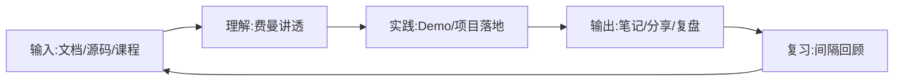

# 高效学习法

## 1. 文档说明

| 属性 | 说明 |
|------|------|
| 文档版本 | V1.0 |
| 生效日期 | 2026-08-15 |
| 适用范围 | 公司所有研发人员 |
| 作者 | 架构组 |

> **用途**：沉淀个人与团队的高效学习方法论，覆盖费曼技巧、刻意练习、艾宾浩斯复习、输出倒逼输入等核心方法，并给出技术学习路线建议，帮助研发人员建立可持续的知识增长体系。

---

## 2. 学习底层方法论

### 2.1 费曼技巧（以教代学）

核心理念：**能用自己的话讲清楚，才是真正学会**。把复杂概念翻译成小白也能听懂的语言。

```text
四步流程：
1. 选概念：挑一个要学的知识点
2. 讲清楚：假装讲给 8 岁小孩，用自己的话写/说一遍
3. 找漏洞：卡壳处就是理解盲区，回到资料重新学
4. 简化提炼：去掉术语，用类比和例子重组表述
```

> 【推荐】技术文档、Code Review 讲解、新人培训都适用费曼技巧——讲不清 = 没学会。

### 2.2 刻意练习（舒适区边缘）

练习必须**有明确目标、即时反馈、跳出舒适区**，重复低水平练习无效。

| 要素 | 说明 |
|------|------|
| 明确目标 | 每次练习只针对一个薄弱点（如只练流控算法） |
| 即时反馈 | 用 LeetCode 判题、Code Review、测试结果做反馈 |
| 跳出舒适区 | 难度略高于当前水平，避免"熟练的无效重复" |
| 分解拆解 | 把大技能拆成可单独训练的小模块 |

### 2.3 艾宾浩斯遗忘曲线（间隔复习）

遗忘先快后慢，需在关键时间点重复：

```text
复习节点：学习后 20 分钟 → 1 小时 → 当天 → 第 2 天 → 第 7 天 → 第 30 天
工具支撑：Anki 卡片、笔记系统的定期回顾队列、季度复盘
```

> 【推荐】新学的框架/源码知识点必须落到复习队列，否则 1 周后留存率不足 30%。

### 2.4 输出倒逼输入

- 写技术笔记/博客：把碎片输入整理成结构化输出
- 做技术分享：公开承诺后倒逼系统学习
- 写复盘：故障、压测、项目结项后强制沉淀

---

## 3. 技术学习路线建议

### 3.1 后端工程师路线（对齐公司技术栈）

```text
阶段 0  基础：Java 语言（JDK 25 新特性）→ 数据结构与算法
阶段 1  框架：Spring Boot 4.x → Spring Cloud 2024.x → MyBatis
阶段 2  数据：MySQL 8.x（索引/事务/调优）→ Redis（缓存/分布式锁）
阶段 3  中间件：Nacos 2.x → Kafka/RabbitMQ → Elasticsearch
阶段 4  工程化：Gradle 8.x → Docker/K8s → CI/CD
阶段 5  架构：微服务拆分 → 高并发/缓存/分库分表 → 源码阅读
```

### 3.2 学习节奏建议

| 周期 | 目标 | 输出物 |
|------|------|--------|
| 每日 30 分钟 | 保持手感：刷题/读源码/看文档 | 笔记 1 则 |
| 每周 2 小时 | 一个主题深入（如 GC 调优） | 专题笔记 + 实践 |
| 每季度 | 一个完整项目或源码专题 | 技术分享 / 复盘文档 |

### 3.3 知识管理闭环



---

## 4. 学习工具

| 类别 | 工具 | 用途 |
|------|------|------|
| 笔记 | 飞书文档 / Obsidian | 结构化沉淀、双链回顾 |
| 卡片复习 | Anki | 艾宾浩斯间隔重复 |
| 刷题 | LeetCode | 算法刻意练习、即时反馈 |
| 源码 | GitHub / 官方文档 | 一手资料，避免二手解读 |
| 复盘 | 团队 wiki | 沉淀案例，防重复踩坑 |

> 笔记建议遵循 [文档书写规范](../00-开发规范/文档书写规范.md)，保证沉淀质量与可检索性。

---

## 5. 落地检查清单

| 序号 | 检查项 | 检查方式 | 责任人 |
|------|--------|---------|--------|
| 1 | 新知识先费曼讲一遍再落库 | 笔记核对 | 研发人员 |
| 2 | 学习计划有明确目标与输出物 | 计划核对 | 研发人员 |
| 3 | 技术笔记进入复习队列 | 工具核对 | 研发人员 |
| 4 | 季度至少 1 次技术分享/复盘 | 分享记录 | 团队负责人 |
| 5 | 笔记符合文档书写规范 | 抽查 | 架构组 |

---

**文档结束**

*本文档由 pangpang-doc 维护*
